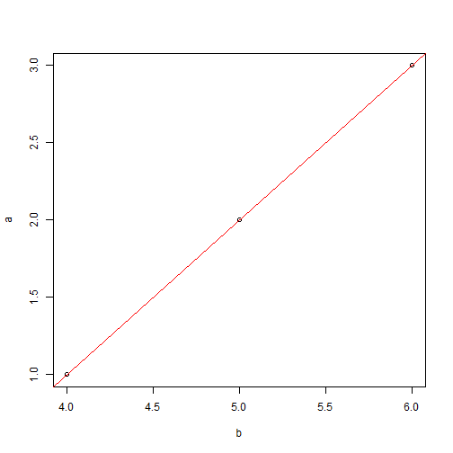

RStudio:R语言编辑器
======================
# 四窗口 
左上：写代码，运行的方式是ctrl+Enter，或者用Run按钮

```r
10 + 15
```

```
## [1] 25
```

左下：终端，上面窗口的代码运行后会在这里显示，也可以直接在这里写代码 

右上：工作区，显示变量，还有一个历史记录 

右下：这个里面的有几个窗口，可以显示画的图


```r
a = c(1, 2, 3)
b = c(4, 5, 6)
plot(b, a)
fit = lm(a ~ b)
abline(fit, col = "red")
```

 

也可以安装包，显示帮助

```r
# ?plot
```

# 文学化编程，knitr

Tools->option->Sweave:knitr 具体看"knitr与可重复研究“ 

http://cos.name/2012/06/reproducible-research-with-knitr/

以及"自动化报告"

https://github.com/yihui/r-ninja/blob/master/11-auto-report.md

knitr的主页：http://yihui.name/knitr/ ,里面有一个视频，大家可以学习。


# 文本的格式

代码的起始和终止 在报告中的是否输出代码，用echo控制

# vim模式

Tools->option->Code Editing 最后一个选项 Enable vim editing mode

# 
