R 语言画图的基本参数
=======================
# 点
## 点的种类
点的种类参数为 pch，每一种符号对应一个数字编号

```r
# 点有25种，为了展示25种点
x = 1:25
y = 1:25
x
```

```
##  [1]  1  2  3  4  5  6  7  8  9 10 11 12 13 14 15 16 17 18 19 20 21 22 23
## [24] 24 25
```

```r
plot(x, x, pch = x)
# 在图上随意添加点
lines(10, 15, type = "b", pch = 5)
```

 

```r
# type的含义
plot(x, y, type = "p", pch = x)  #point 仅仅画出点
```

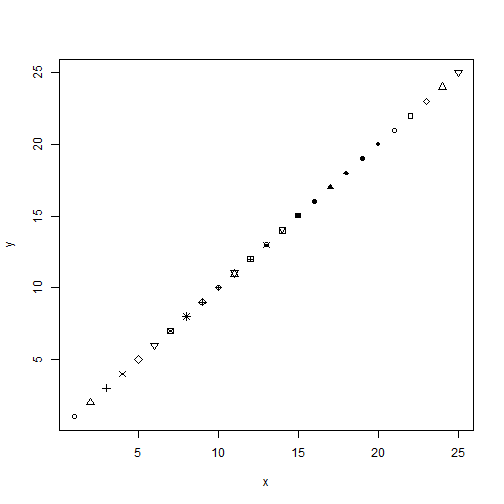 

```r
plot(x, y, type = "l", pch = x)  #line 仅仅画出线
```

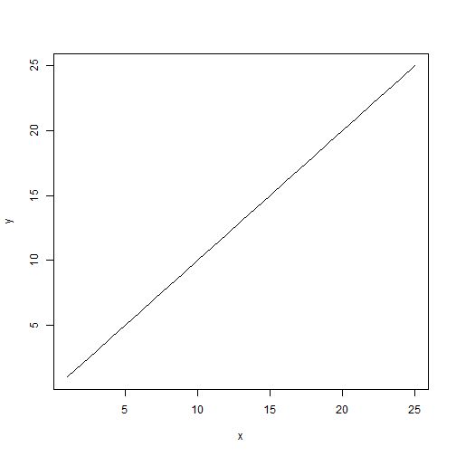 

```r
plot(x, y, type = "b", pch = x)  #both 同时画出点线,注意和o的区别,没有覆盖
```

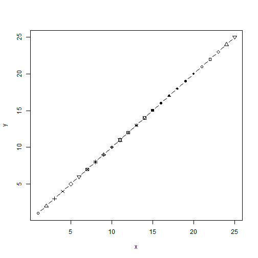 

```r
plot(x, y, type = "c", pch = x)  #  画出线，但是点所在的位置为空
```

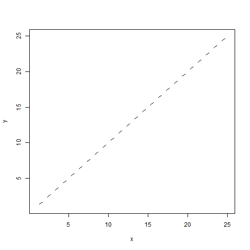 

```r
plot(x, y, type = "o", pch = x)  #overlap  画出点线，线覆盖点
```

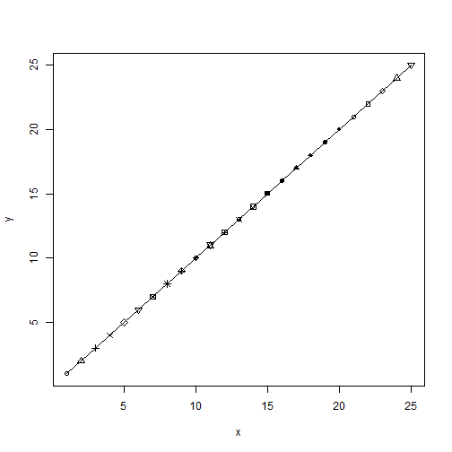 

```r
plot(x, y, type = "s", pch = x)  #step  台阶
```

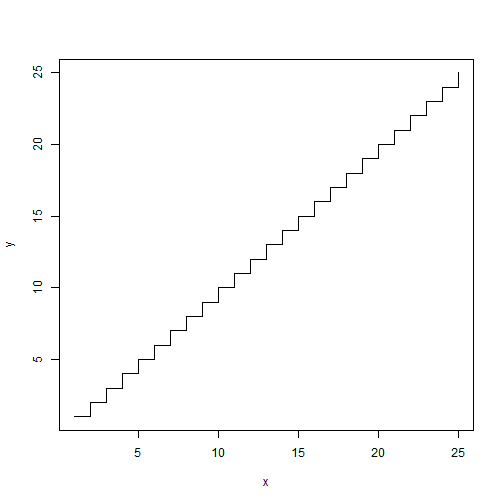 

```r
plot(x, y, type = "h", pch = x)  #hist  类似直方图
```

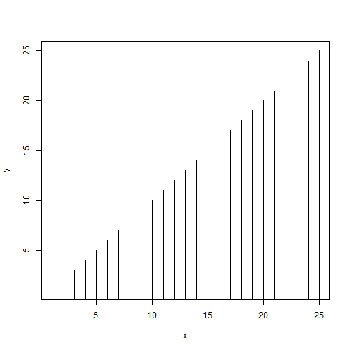 

```r
plot(x, y, type = "n", pch = x)  #none  一个空白
```

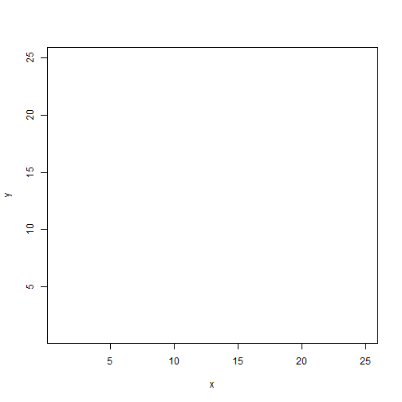 

```r

```

## 点的大小
点的大小的参数为cex

```r
plot(x, x, pch = x, cex = x)
```

 

# 线
## 线的种类
线的种类参数为lty

```r
# 首先来一个比较简单的数据
a = c(1, 10)
plot(a, a, type = "b", lty = 1)
```

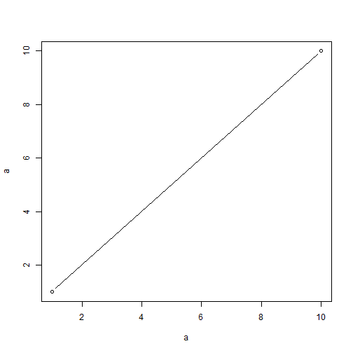 

```r
plot(a, a, type = "b", lty = 2)
# 6种线，分别对应lty = 1，2，3，4，5，6
# 通过在图上添加参考线来认识一下这六种线 添加参考线的函数为abline
# ?abline()
b = 1:6
abline(h = b, lty = b)
abline(v = b, lty = b)
abline(a = 4, b = 5, lty = b)
abline(a = 0, b = 5, lty = b)
```

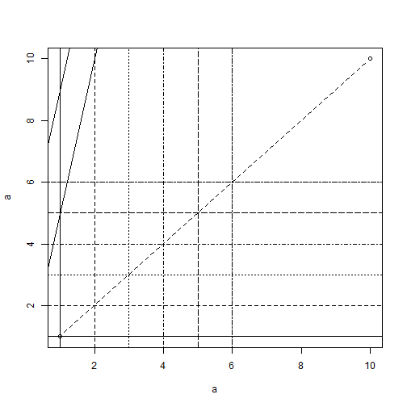 

## 线的粗细
线的粗细的参数为lwd

```r
abline(h = b, lty = b, lwd = b)
```

```
## Error: 还没有调用plot.new
```

```r
plot(x, y, lwd = 1)
```

 

```r
plot(a, a, type = "b", lwd = 5)
```

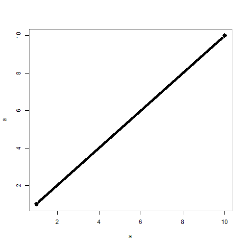 

```r
plot(a, a, type = "b", lwd = 1)
```

 


# 色
色的参数为col

```r
# 颜色可以用我们单词表示
plot(x, x, col = "blue", pch = 20)  #颜色名称
```

 

```r
plot(x, x, col = "red", pch = 20)  #颜色名称
```

 

```r

# 或者用数字表示
plot(x, x, col = 1, pch = 20)  #颜色下标
```

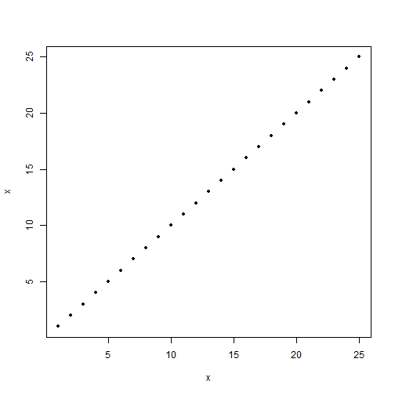 

```r
plot(x, x, col = 2, pch = 20)
```

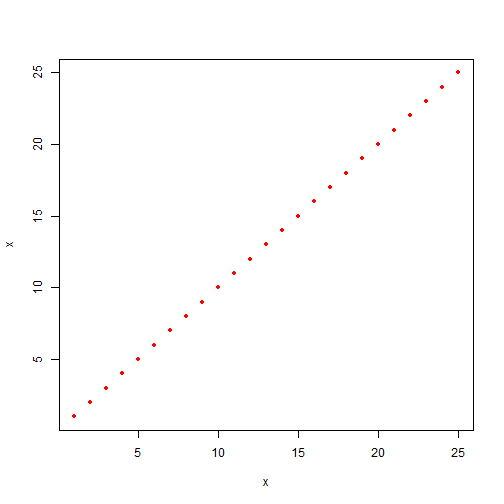 

```r
plot(x, x, col = "#FFFFFF", pch = 20)  #16进制颜色值
```

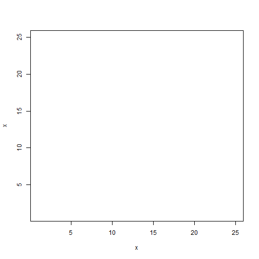 

```r
plot(x, x, col = "#0000FF", pch = 20)  #蓝色
```

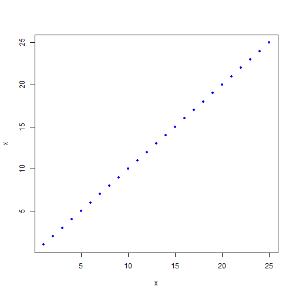 

```r
plot(x, x, col = rgb(0.5, 0.5, 0.5), pch = 20)  #RGB red,green,black
```

 

```r
plot(x, x, col = hsv(0, 0, 0.5), pch = 20)  #hsv 色相-饱和度-亮度

# 彩虹型颜色
plot(x, x, col = rainbow(10), pch = 20)
```

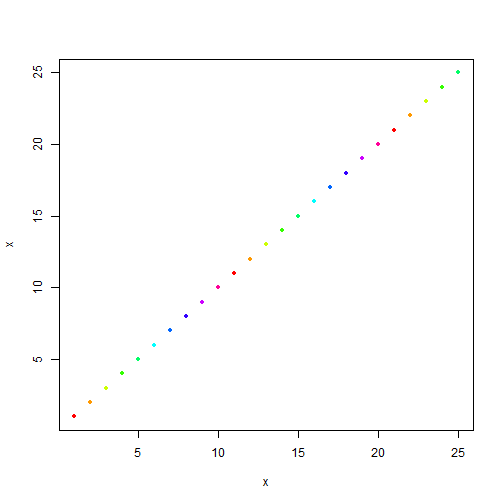 

```r
pie(rep(1, 10), col = rainbow(10))
```

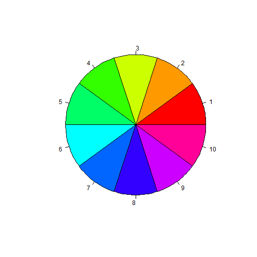 

```r
# 多阶灰度
pie(rep(1, 10), col = gray(0:10/10))
```

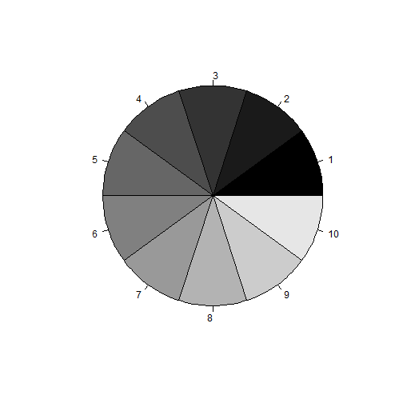 

```r

# 查看所有的颜色的名称的列表，可以用
colours()
```

```
##   [1] "white"                "aliceblue"            "antiquewhite"        
##   [4] "antiquewhite1"        "antiquewhite2"        "antiquewhite3"       
##   [7] "antiquewhite4"        "aquamarine"           "aquamarine1"         
##  [10] "aquamarine2"          "aquamarine3"          "aquamarine4"         
##  [13] "azure"                "azure1"               "azure2"              
##  [16] "azure3"               "azure4"               "beige"               
##  [19] "bisque"               "bisque1"              "bisque2"             
##  [22] "bisque3"              "bisque4"              "black"               
##  [25] "blanchedalmond"       "blue"                 "blue1"               
##  [28] "blue2"                "blue3"                "blue4"               
##  [31] "blueviolet"           "brown"                "brown1"              
##  [34] "brown2"               "brown3"               "brown4"              
##  [37] "burlywood"            "burlywood1"           "burlywood2"          
##  [40] "burlywood3"           "burlywood4"           "cadetblue"           
##  [43] "cadetblue1"           "cadetblue2"           "cadetblue3"          
##  [46] "cadetblue4"           "chartreuse"           "chartreuse1"         
##  [49] "chartreuse2"          "chartreuse3"          "chartreuse4"         
##  [52] "chocolate"            "chocolate1"           "chocolate2"          
##  [55] "chocolate3"           "chocolate4"           "coral"               
##  [58] "coral1"               "coral2"               "coral3"              
##  [61] "coral4"               "cornflowerblue"       "cornsilk"            
##  [64] "cornsilk1"            "cornsilk2"            "cornsilk3"           
##  [67] "cornsilk4"            "cyan"                 "cyan1"               
##  [70] "cyan2"                "cyan3"                "cyan4"               
##  [73] "darkblue"             "darkcyan"             "darkgoldenrod"       
##  [76] "darkgoldenrod1"       "darkgoldenrod2"       "darkgoldenrod3"      
##  [79] "darkgoldenrod4"       "darkgray"             "darkgreen"           
##  [82] "darkgrey"             "darkkhaki"            "darkmagenta"         
##  [85] "darkolivegreen"       "darkolivegreen1"      "darkolivegreen2"     
##  [88] "darkolivegreen3"      "darkolivegreen4"      "darkorange"          
##  [91] "darkorange1"          "darkorange2"          "darkorange3"         
##  [94] "darkorange4"          "darkorchid"           "darkorchid1"         
##  [97] "darkorchid2"          "darkorchid3"          "darkorchid4"         
## [100] "darkred"              "darksalmon"           "darkseagreen"        
## [103] "darkseagreen1"        "darkseagreen2"        "darkseagreen3"       
## [106] "darkseagreen4"        "darkslateblue"        "darkslategray"       
## [109] "darkslategray1"       "darkslategray2"       "darkslategray3"      
## [112] "darkslategray4"       "darkslategrey"        "darkturquoise"       
## [115] "darkviolet"           "deeppink"             "deeppink1"           
## [118] "deeppink2"            "deeppink3"            "deeppink4"           
## [121] "deepskyblue"          "deepskyblue1"         "deepskyblue2"        
## [124] "deepskyblue3"         "deepskyblue4"         "dimgray"             
## [127] "dimgrey"              "dodgerblue"           "dodgerblue1"         
## [130] "dodgerblue2"          "dodgerblue3"          "dodgerblue4"         
## [133] "firebrick"            "firebrick1"           "firebrick2"          
## [136] "firebrick3"           "firebrick4"           "floralwhite"         
## [139] "forestgreen"          "gainsboro"            "ghostwhite"          
## [142] "gold"                 "gold1"                "gold2"               
## [145] "gold3"                "gold4"                "goldenrod"           
## [148] "goldenrod1"           "goldenrod2"           "goldenrod3"          
## [151] "goldenrod4"           "gray"                 "gray0"               
## [154] "gray1"                "gray2"                "gray3"               
## [157] "gray4"                "gray5"                "gray6"               
## [160] "gray7"                "gray8"                "gray9"               
## [163] "gray10"               "gray11"               "gray12"              
## [166] "gray13"               "gray14"               "gray15"              
## [169] "gray16"               "gray17"               "gray18"              
## [172] "gray19"               "gray20"               "gray21"              
## [175] "gray22"               "gray23"               "gray24"              
## [178] "gray25"               "gray26"               "gray27"              
## [181] "gray28"               "gray29"               "gray30"              
## [184] "gray31"               "gray32"               "gray33"              
## [187] "gray34"               "gray35"               "gray36"              
## [190] "gray37"               "gray38"               "gray39"              
## [193] "gray40"               "gray41"               "gray42"              
## [196] "gray43"               "gray44"               "gray45"              
## [199] "gray46"               "gray47"               "gray48"              
## [202] "gray49"               "gray50"               "gray51"              
## [205] "gray52"               "gray53"               "gray54"              
## [208] "gray55"               "gray56"               "gray57"              
## [211] "gray58"               "gray59"               "gray60"              
## [214] "gray61"               "gray62"               "gray63"              
## [217] "gray64"               "gray65"               "gray66"              
## [220] "gray67"               "gray68"               "gray69"              
## [223] "gray70"               "gray71"               "gray72"              
## [226] "gray73"               "gray74"               "gray75"              
## [229] "gray76"               "gray77"               "gray78"              
## [232] "gray79"               "gray80"               "gray81"              
## [235] "gray82"               "gray83"               "gray84"              
## [238] "gray85"               "gray86"               "gray87"              
## [241] "gray88"               "gray89"               "gray90"              
## [244] "gray91"               "gray92"               "gray93"              
## [247] "gray94"               "gray95"               "gray96"              
## [250] "gray97"               "gray98"               "gray99"              
## [253] "gray100"              "green"                "green1"              
## [256] "green2"               "green3"               "green4"              
## [259] "greenyellow"          "grey"                 "grey0"               
## [262] "grey1"                "grey2"                "grey3"               
## [265] "grey4"                "grey5"                "grey6"               
## [268] "grey7"                "grey8"                "grey9"               
## [271] "grey10"               "grey11"               "grey12"              
## [274] "grey13"               "grey14"               "grey15"              
## [277] "grey16"               "grey17"               "grey18"              
## [280] "grey19"               "grey20"               "grey21"              
## [283] "grey22"               "grey23"               "grey24"              
## [286] "grey25"               "grey26"               "grey27"              
## [289] "grey28"               "grey29"               "grey30"              
## [292] "grey31"               "grey32"               "grey33"              
## [295] "grey34"               "grey35"               "grey36"              
## [298] "grey37"               "grey38"               "grey39"              
## [301] "grey40"               "grey41"               "grey42"              
## [304] "grey43"               "grey44"               "grey45"              
## [307] "grey46"               "grey47"               "grey48"              
## [310] "grey49"               "grey50"               "grey51"              
## [313] "grey52"               "grey53"               "grey54"              
## [316] "grey55"               "grey56"               "grey57"              
## [319] "grey58"               "grey59"               "grey60"              
## [322] "grey61"               "grey62"               "grey63"              
## [325] "grey64"               "grey65"               "grey66"              
## [328] "grey67"               "grey68"               "grey69"              
## [331] "grey70"               "grey71"               "grey72"              
## [334] "grey73"               "grey74"               "grey75"              
## [337] "grey76"               "grey77"               "grey78"              
## [340] "grey79"               "grey80"               "grey81"              
## [343] "grey82"               "grey83"               "grey84"              
## [346] "grey85"               "grey86"               "grey87"              
## [349] "grey88"               "grey89"               "grey90"              
## [352] "grey91"               "grey92"               "grey93"              
## [355] "grey94"               "grey95"               "grey96"              
## [358] "grey97"               "grey98"               "grey99"              
## [361] "grey100"              "honeydew"             "honeydew1"           
## [364] "honeydew2"            "honeydew3"            "honeydew4"           
## [367] "hotpink"              "hotpink1"             "hotpink2"            
## [370] "hotpink3"             "hotpink4"             "indianred"           
## [373] "indianred1"           "indianred2"           "indianred3"          
## [376] "indianred4"           "ivory"                "ivory1"              
## [379] "ivory2"               "ivory3"               "ivory4"              
## [382] "khaki"                "khaki1"               "khaki2"              
## [385] "khaki3"               "khaki4"               "lavender"            
## [388] "lavenderblush"        "lavenderblush1"       "lavenderblush2"      
## [391] "lavenderblush3"       "lavenderblush4"       "lawngreen"           
## [394] "lemonchiffon"         "lemonchiffon1"        "lemonchiffon2"       
## [397] "lemonchiffon3"        "lemonchiffon4"        "lightblue"           
## [400] "lightblue1"           "lightblue2"           "lightblue3"          
## [403] "lightblue4"           "lightcoral"           "lightcyan"           
## [406] "lightcyan1"           "lightcyan2"           "lightcyan3"          
## [409] "lightcyan4"           "lightgoldenrod"       "lightgoldenrod1"     
## [412] "lightgoldenrod2"      "lightgoldenrod3"      "lightgoldenrod4"     
## [415] "lightgoldenrodyellow" "lightgray"            "lightgreen"          
## [418] "lightgrey"            "lightpink"            "lightpink1"          
## [421] "lightpink2"           "lightpink3"           "lightpink4"          
## [424] "lightsalmon"          "lightsalmon1"         "lightsalmon2"        
## [427] "lightsalmon3"         "lightsalmon4"         "lightseagreen"       
## [430] "lightskyblue"         "lightskyblue1"        "lightskyblue2"       
## [433] "lightskyblue3"        "lightskyblue4"        "lightslateblue"      
## [436] "lightslategray"       "lightslategrey"       "lightsteelblue"      
## [439] "lightsteelblue1"      "lightsteelblue2"      "lightsteelblue3"     
## [442] "lightsteelblue4"      "lightyellow"          "lightyellow1"        
## [445] "lightyellow2"         "lightyellow3"         "lightyellow4"        
## [448] "limegreen"            "linen"                "magenta"             
## [451] "magenta1"             "magenta2"             "magenta3"            
## [454] "magenta4"             "maroon"               "maroon1"             
## [457] "maroon2"              "maroon3"              "maroon4"             
## [460] "mediumaquamarine"     "mediumblue"           "mediumorchid"        
## [463] "mediumorchid1"        "mediumorchid2"        "mediumorchid3"       
## [466] "mediumorchid4"        "mediumpurple"         "mediumpurple1"       
## [469] "mediumpurple2"        "mediumpurple3"        "mediumpurple4"       
## [472] "mediumseagreen"       "mediumslateblue"      "mediumspringgreen"   
## [475] "mediumturquoise"      "mediumvioletred"      "midnightblue"        
## [478] "mintcream"            "mistyrose"            "mistyrose1"          
## [481] "mistyrose2"           "mistyrose3"           "mistyrose4"          
## [484] "moccasin"             "navajowhite"          "navajowhite1"        
## [487] "navajowhite2"         "navajowhite3"         "navajowhite4"        
## [490] "navy"                 "navyblue"             "oldlace"             
## [493] "olivedrab"            "olivedrab1"           "olivedrab2"          
## [496] "olivedrab3"           "olivedrab4"           "orange"              
## [499] "orange1"              "orange2"              "orange3"             
## [502] "orange4"              "orangered"            "orangered1"          
## [505] "orangered2"           "orangered3"           "orangered4"          
## [508] "orchid"               "orchid1"              "orchid2"             
## [511] "orchid3"              "orchid4"              "palegoldenrod"       
## [514] "palegreen"            "palegreen1"           "palegreen2"          
## [517] "palegreen3"           "palegreen4"           "paleturquoise"       
## [520] "paleturquoise1"       "paleturquoise2"       "paleturquoise3"      
## [523] "paleturquoise4"       "palevioletred"        "palevioletred1"      
## [526] "palevioletred2"       "palevioletred3"       "palevioletred4"      
## [529] "papayawhip"           "peachpuff"            "peachpuff1"          
## [532] "peachpuff2"           "peachpuff3"           "peachpuff4"          
## [535] "peru"                 "pink"                 "pink1"               
## [538] "pink2"                "pink3"                "pink4"               
## [541] "plum"                 "plum1"                "plum2"               
## [544] "plum3"                "plum4"                "powderblue"          
## [547] "purple"               "purple1"              "purple2"             
## [550] "purple3"              "purple4"              "red"                 
## [553] "red1"                 "red2"                 "red3"                
## [556] "red4"                 "rosybrown"            "rosybrown1"          
## [559] "rosybrown2"           "rosybrown3"           "rosybrown4"          
## [562] "royalblue"            "royalblue1"           "royalblue2"          
## [565] "royalblue3"           "royalblue4"           "saddlebrown"         
## [568] "salmon"               "salmon1"              "salmon2"             
## [571] "salmon3"              "salmon4"              "sandybrown"          
## [574] "seagreen"             "seagreen1"            "seagreen2"           
## [577] "seagreen3"            "seagreen4"            "seashell"            
## [580] "seashell1"            "seashell2"            "seashell3"           
## [583] "seashell4"            "sienna"               "sienna1"             
## [586] "sienna2"              "sienna3"              "sienna4"             
## [589] "skyblue"              "skyblue1"             "skyblue2"            
## [592] "skyblue3"             "skyblue4"             "slateblue"           
## [595] "slateblue1"           "slateblue2"           "slateblue3"          
## [598] "slateblue4"           "slategray"            "slategray1"          
## [601] "slategray2"           "slategray3"           "slategray4"          
## [604] "slategrey"            "snow"                 "snow1"               
## [607] "snow2"                "snow3"                "snow4"               
## [610] "springgreen"          "springgreen1"         "springgreen2"        
## [613] "springgreen3"         "springgreen4"         "steelblue"           
## [616] "steelblue1"           "steelblue2"           "steelblue3"          
## [619] "steelblue4"           "tan"                  "tan1"                
## [622] "tan2"                 "tan3"                 "tan4"                
## [625] "thistle"              "thistle1"             "thistle2"            
## [628] "thistle3"             "thistle4"             "tomato"              
## [631] "tomato1"              "tomato2"              "tomato3"             
## [634] "tomato4"              "turquoise"            "turquoise1"          
## [637] "turquoise2"           "turquoise3"           "turquoise4"          
## [640] "violet"               "violetred"            "violetred1"          
## [643] "violetred2"           "violetred3"           "violetred4"          
## [646] "wheat"                "wheat1"               "wheat2"              
## [649] "wheat3"               "wheat4"               "whitesmoke"          
## [652] "yellow"               "yellow1"              "yellow2"             
## [655] "yellow3"              "yellow4"              "yellowgreen"
```

我们肯定是记不住这么多颜色的，所以这里有一个专门整理好的网站，供我们参考
http://research.stowers-institute.org/efg/R/Color/Chart/
