# 用R的基础作图系统和ggplot2做常用图
* 作者：扬眉剑 
* 数盟群1：174306879 数盟群2：110875722
* 数盟论坛：http://datameng.com/bbs/forum.php

## 课程目的
* 复习基础作图命令
* 学习基本的ggplot作图命令

这里我们会用R语言中的基础作图系统和ggplot2中的qplot以及ggplot作常见的图。

下面是几种常见的图：
* 散点图
* 线图
* 条形图
* 直方图,和密度图
* 箱线图

常见的图形的代码都在下面的网站里。
http://docs.ggplot2.org/current/

## 命令简介
* plot: 是R基础作图的命令
* qplot:quick plot,是ggplot2中的简易作图系统。
* ggplot:是ggplot2的作图命令

## ggplot2的安装,和载入

```r
# install.packages('ggplot2')
library(ggplot2)
```


## 散点图 
### plot

```r
# 使用的数据集
head(mtcars)
```

```
##                    mpg cyl disp  hp drat    wt  qsec vs am gear carb
## Mazda RX4         21.0   6  160 110 3.90 2.620 16.46  0  1    4    4
## Mazda RX4 Wag     21.0   6  160 110 3.90 2.875 17.02  0  1    4    4
## Datsun 710        22.8   4  108  93 3.85 2.320 18.61  1  1    4    1
## Hornet 4 Drive    21.4   6  258 110 3.08 3.215 19.44  1  0    3    1
## Hornet Sportabout 18.7   8  360 175 3.15 3.440 17.02  0  0    3    2
## Valiant           18.1   6  225 105 2.76 3.460 20.22  1  0    3    1
```

```r
plot(mtcars$wt, mtcars$mpg, col = "red")
```

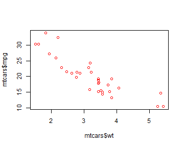 

 plot后面必须要有横坐标的数据和纵坐标的数据，
 col控制的是颜色
 如果我们要指定图形的其他属性，那么要添加其他的参数

```r
plot(mtcars$wt, mtcars$mpg, col = "red", cex = 2, pch = 25)
```

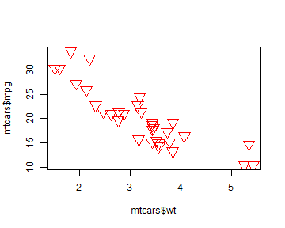 

pch控制点的符号，cex控制符号的大小，具体请看帮助文档。

### qplot
qplot与plot非常相似
这里用colour控制颜色,意思更明显

```r
qplot(mtcars$wt, mtcars$mpg, colour = "red", size = 2)
```

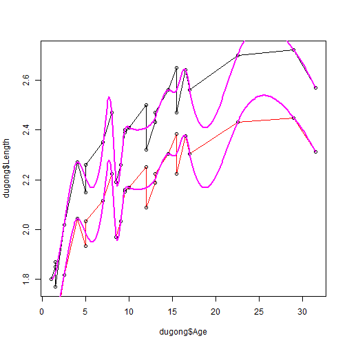 

geom：geometric object几何对象
 也就是我们可以控制geom来绘制不同的图形
 比如我们现在的散点图，我们把geom的参数设置为point,也就是散点图的意思

```r
qplot(mtcars$wt, mtcars$mpg, geom = "point", colour = "red", size = 2)
```

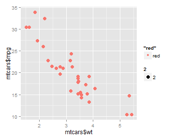 

另外一种方式，通过data来控制数据集，和上面是一样的效果。

```r
qplot(wt, mpg, data = mtcars, geom = "point", colour = "red", size = 2)
```

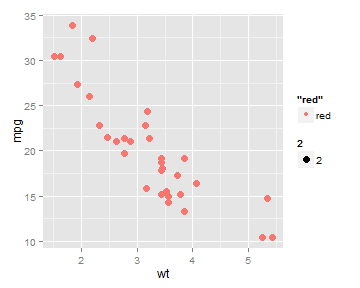 

### ggplot
我们再来用ggplot画散点图。这里形式就稍微不同。
用ggplot命令来画图，可以分成两部分：

第一:数据集，ggplot(mtcars,aes(x=wt,y=mpg)),通过这一句设置画图需要用的数据。

第二：图的类型，这里用geom_point,geom_line等。

```r
ggplot(mtcars, aes(x = wt, y = mpg)) + geom_point(colour = "red", size = 3)
```

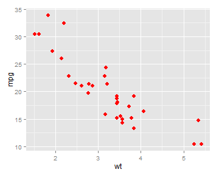 

## 线图
### plot
线条的添加其实在plot上用type="l",也就是line的意思

```r
x = c(1, 3, 4, 9, 11, 17, 3, 4)
y = c(2, 5, 9, 12, 15, 19, 6, 8)
data1 = data.frame(x, y)
plot(x, y, type = "l")
# 在线上添加点
points(x, y)
y1 = y * 0.9
# 添加一条线
lines(x, y1, col = "red")
points(x, y1)
# 添加平滑曲线 用spline来添加
lines(spline(x, y, n = 20), col = 454, lwd = 2)
# n越大曲线越平滑
lines(spline(x, y, n = 201), col = 454, lwd = 2)
lines(spline(x, y1, n = 201), col = 454, lwd = 2)
```

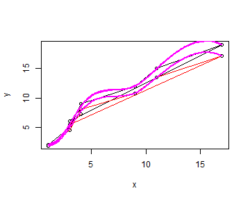 

### qplot
geom可以通过不同的设置来添加不同的曲线。
并且可以给geom赋多个值。如下：

```r
# 折线图
qplot(data1$x, data1$y, geom = "line")
```

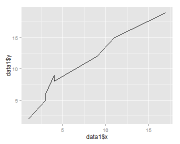 

```r
# 折线+点图
qplot(x, y, data = data1, geom = c("line", "point"), colour = "red")
```

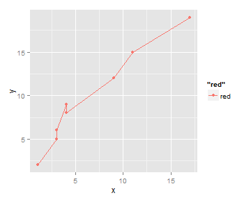 

```r
# 折线+点+平滑的模拟曲线 阴影表示的是95%的置信区间
qplot(x, y, data = data1, geom = c("line", "point", "smooth"))
```

```
## geom_smooth: method="auto" and size of largest group is <1000, so using loess. Use 'method = x' to change the smoothing method.
```

 

### ggplot

```r
ggplot(data1, aes(x = x, y = y)) + geom_line()
```

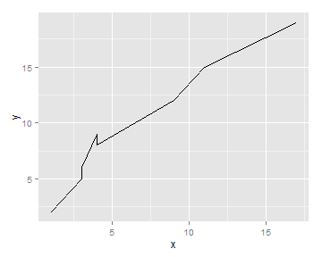 

```r
ggplot(data1, aes(x = x, y = y)) + geom_line() + geom_point() + geom_smooth()
```

```
## geom_smooth: method="auto" and size of largest group is <1000, so using loess. Use 'method = x' to change the smoothing method.
```

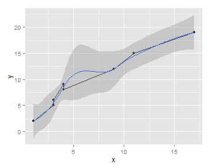 

## 条形图
### barplot

```r
# 用mtcar的数据
data2 = table(mtcars$cyl)
data2
```

```
## 
##  4  6  8 
## 11  7 14
```

```r

barplot(table(mtcars$cyl))
```

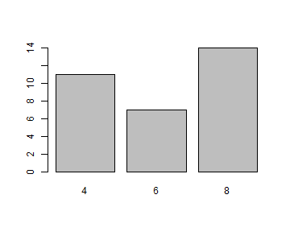 

```r
# names.arg 来设置横坐标的名称
BOD
```

```
##   Time demand
## 1    1    8.3
## 2    2   10.3
## 3    3   19.0
## 4    4   16.0
## 5    5   15.6
## 6    7   19.8
```

```r
barplot(BOD$demand, names.arg = BOD$Time)
```

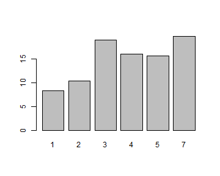 


### qplot

```r
# stat 是统计方式，默认为bin，
# bin的统计方式是对所有的提供的变量的数据进行统计，然后统计的数目作为y轴
qplot(mtcars$cyl)
```

```
## stat_bin: binwidth defaulted to range/30. Use 'binwidth = x' to adjust this.
```

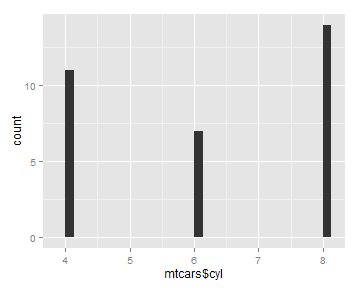 

```r
# 我们看图会发现虽然没有5和7这个点，但是依然空出来位置。
# 如果我们不想要这个位置，我们首先要把x轴的元素编程因子（factor）
qplot(factor(mtcars$cyl))
```

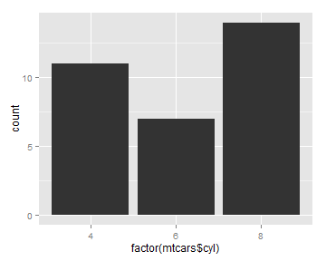 

```r
# 如果数据是已经统计好的，那么我们需要改变统计的方式
# 这里我们修改为identity,这里提供两个参数
qplot(BOD$Time, BOD$demand, geom = "bar", stat = "identity")
```

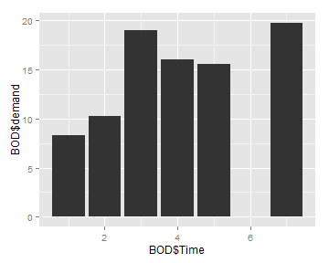 

```r
qplot(factor(BOD$Time), BOD$demand, geom = "bar", stat = "identity")
```

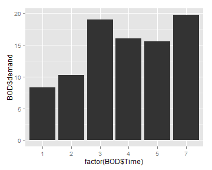 


### ggplot

```r
ggplot(BOD, aes(x = Time, y = demand)) + geom_bar(stat = "identity")
```

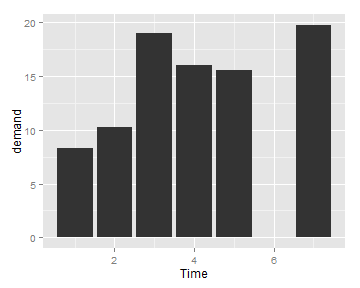 

```r
ggplot(BOD, aes(x = factor(Time), y = demand)) + geom_bar(stat = "identity")
```

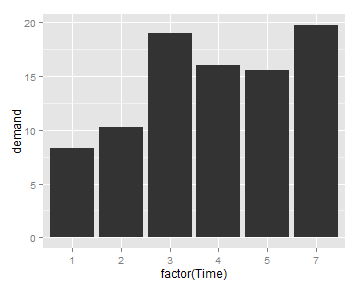 

## 直方图-核密度图
### hist
直方图涉及到一个分组的数量，不如，你把所有的数据分成两组，
就只有2个，分成10个，就有10个,分的越多，越精细。

```r
hist(mtcars$mpg, breaks = 3)
```

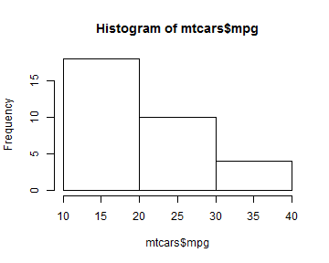 

```r
hist(mtcars$mpg, breaks = 10)
# 添加核密度曲线
lines(density(mtcars$mpg), col = "blue")
```

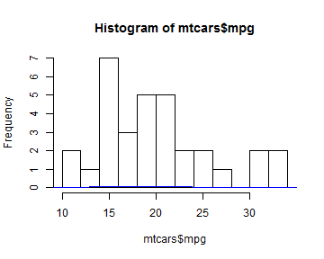 

```r
# 这里我们用density统计了密度，但是我们要知道，在一个整体中，任何一个个体的比重是小于1的
# 如果我们要正确的表现需要做一下修正
hist(mtcars$mpg, breaks = 10, freq = FALSE)
lines(density(mtcars$mpg), col = "blue")
```

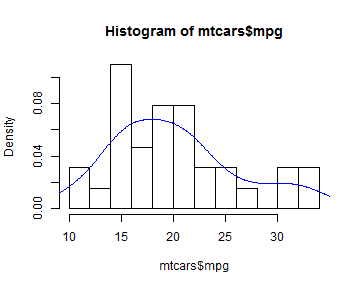 

### qplot
这里和hist有所不同，hist是确定分割的份数，而，qplot确定的是分割的宽度，也就是一份的宽度是多少。
同样道理，宽度越窄，也是越精细的。

```r
qplot(mpg, data = mtcars, geom = "histogram", binwidth = 2)
```

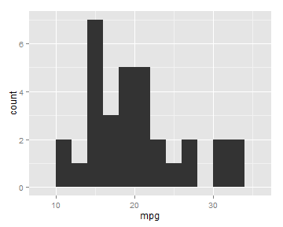 

```r
qplot(mpg, data = mtcars, geom = "histogram", binwidth = 1)
```

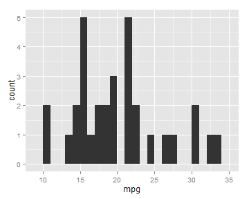 

```r
qplot(mpg, data = mtcars, geom = "density")
```

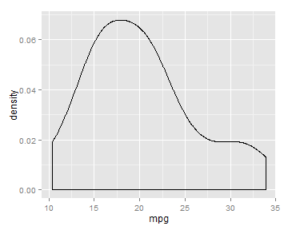 

### ggplot
ggplot的一大特点是图层

```r
# 数据
first = ggplot(mtcars, aes(x = mpg))
# 直方图
first + geom_histogram(binwidth = 2, fill = "red", colour = "black")
```

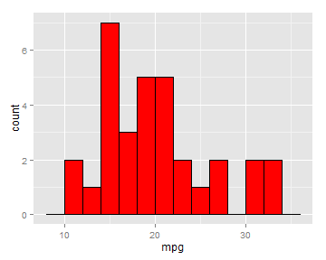 

```r
# 密度图
first + geom_density(fill = "red", colour = "black")
```

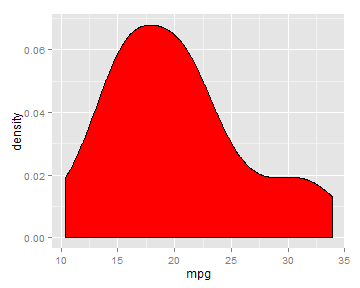 

```r
# 直方图和密度图
first = ggplot(mtcars, aes(x = mpg, y = ..density..))
# 上面的纵坐标表示的是频数，这里..density..把频率转化成频率
first + geom_histogram(binwidth = 2) + geom_density()
```

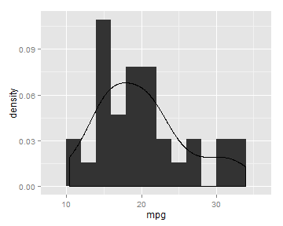 


## 箱线图
### boxplot

```r
# 单个箱线图
boxplot(mtcars$mpg)
```

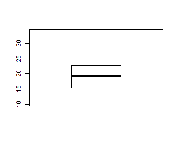 

```r
# 并列箱线图
boxplot(mpg ~ cyl, data = mtcars)
```

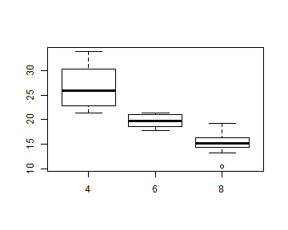 


### qplot

```r
qplot(x = cyl, y = mpg, data = mtcars, geom = "boxplot")
```

 

```r
qplot(x = factor(cyl), y = mpg, data = mtcars, geom = "boxplot")
```

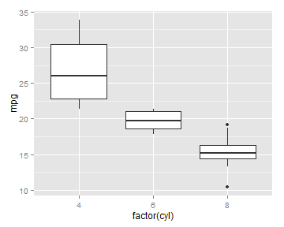 


### ggplot

```r
ggplot(mtcars, aes(x = cyl, y = mpg)) + geom_boxplot()
```

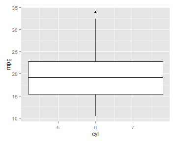 

```r
ggplot(mtcars, aes(x = factor(cyl), y = mpg)) + geom_boxplot()
```

 

