# par()函数的参数详解
本文的内容来自"谢益辉"-《现代统计图形》，其中专门拿了一节
的内容把par的参数进行详细的讲解。对我们增加对作图的控制能力有很大的提升。所以拿过来和大家分享。

修改图形的参数可以在作一幅图的过程中修改，也可以用函数par()进行全局修改，也就是通过par可以控制后面所有图形的属性。

## 调用格式
par(optionname=value,optionname=name,...)
## 数据

```r
x = 1:10
y = x
```


## bg-控制背景颜色
我们首先看bg的原因是，可以清楚的分清边界在那里。

```r
par(bg = "red")
plot(x, y, type = "l")
par(bg = "yellow")
plot(x, y, type = "l")
```

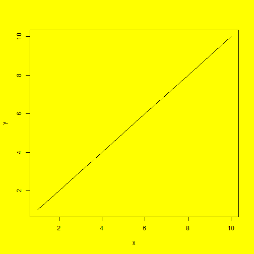 


## mar-控制图形边界宽度(单个图形的边界)
默认的为c(5,4,4,2)+0.1，也就是我们上面做的图都是默认值。顺序为下、左、上、右，也就是顺时针的方向。

```r
par(mar = c(4, 4, 1, 0.5), bg = "yellow")
plot(x, y, type = "l")
par(mar = c(10, 4, 1, 0.5), bg = "yellow")
plot(x, y, type = "l")
par(mar = c(5, 4, 1, 5), bg = "yellow")
plot(x, y, type = "l")
```

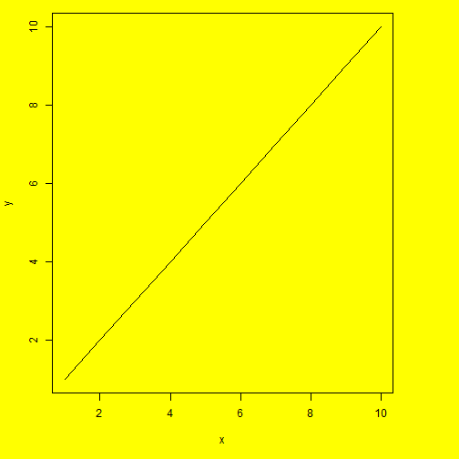 

```r
par(mar = c(5, 4, 4, 2))
```


## adj-调整图中字符的相对位置
adj的值可以是[0,1]之间的任何值，这个设置可以决定text，main的位置。默认是0.5。

```r
# adj=0,左对齐
par(adj = 0, bg = "yellow")
plot(x, y, type = "l", main = "text")
text(4, 6, "Text")
abline(v = 4)
```

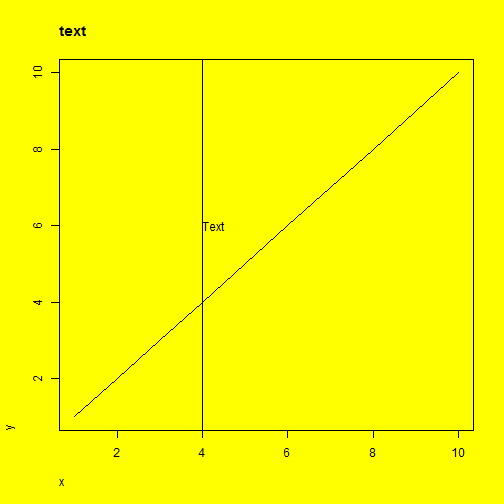 

```r

# adj=0.5,中间对齐
par(adj = 0.5, bg = "yellow")
plot(x, y, type = "l", main = "text")
text(4, 6, "Text")
mtext("Mtext", side = 3)
abline(v = 4)
abline(v = 5.3)
```

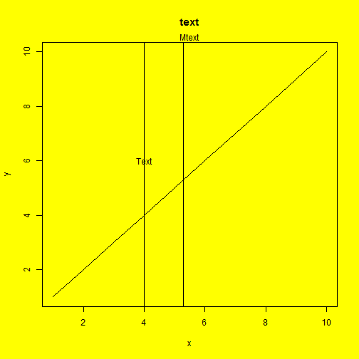 

```r

# adj=1,右对齐
par(adj = 1, bg = "yellow")
plot(x, y, type = "l", main = "text")
text(4, 6, "Text")
abline(v = 4)

# mtext的需要单独跳帧
mtext("mtext", side = 3, adj = 0)
mtext("mtext", side = 3, adj = 0.5)
mtext("mtext", side = 3, adj = 1)
```

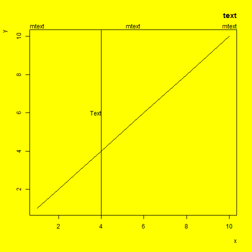 


## ask
切换到下一个新的作图设备(通常是一幅新图)时是否需要用户输入（敲回车或者点击鼠标）。TRUE表示是，FALSE表示否。

## bty-设置图形的边框样式
取值为o,1,7,c，u,]之一

```r
plot(x, y)
# o 四边都显示,o是一个圈
par(bty = "o")
plot(x, y)
# l 显示左下,显示的边就是大写的L
par(bty = "l")
plot(x, y)
# 7 显示的是右和上，和7一样的模样
par(bty = "7")
plot(x, y)
# c 和c一样，显示的是上，左下
par(bty = "c")
plot(x, y)
# u 都不用想，肯定是左下右了
par(bty = "u")
plot(x, y)
```

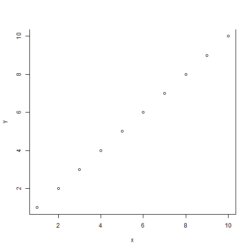 


## cex-图上元素的（文本和符号）的缩放倍数
包括cex.axis(坐标轴刻度标记),cex.lab(坐标轴标题)，cex.main(图主标题)，cex.sub(图副标题)。这个比较常用。一般都单独设置了
## col-图中符号颜色（点，线的颜色）
也很常用，也一般都单独设置
## family-设置文本字体族
标准取值为serif(衬线)，sans（无衬线），mono（等宽），symbol（符号字体）。也可以单独设置。

```r
plot(x, y)
par(family = "serif")
text(4, 4, "a.txt")
par(family = "sans")
text(4, 5, "a.txt")
```

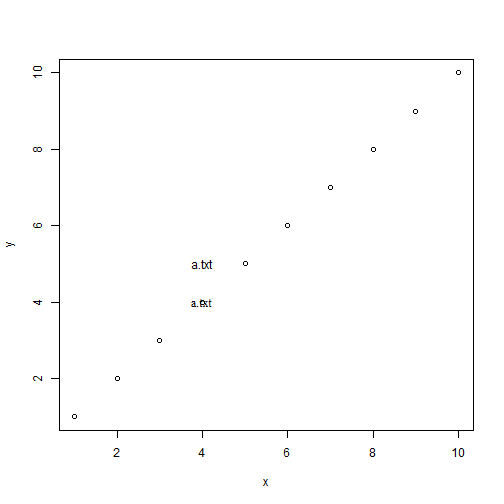 


## fg-前景色
## font-设置文本字体样式
取值分别是1（正常），2（粗体），3（斜体），4（粗斜体）

```r
plot(x, y)
text(2, 3, "how are you", font = 1)
text(2, 4, "how are you", font = 2)
text(2, 5, "how are you", font = 3)
text(2, 6, "how are you", font = 4)
```

 


## lab-设置坐标轴刻度数目
设置坐标轴刻度数目（R会尽量自动取整），取值形式c(x,y,len)。x和y分别设置两轴的刻度数目，len尚未生效,但是要加上。

```r
# 分别设置为5个
par(lab = c(5, 5, 3))
plot(x, y)
# 分别设置为10个
par(lab = c(10, 10, 3))
plot(x, y)
```

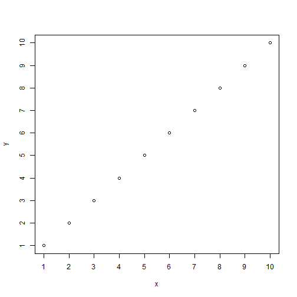 


## las-坐标轴标签的样式
取值为：
0：总是平行与坐标轴
1：总是水平
2：总是垂直与坐标轴
3：总是竖直
在处理一些长标签的时候可以起到很好的作用

```r
par(las = 0)
plot(x, y)
par(las = 1)
plot(x, y)
par(las = 2)
plot(x, y)
par(las = 3)
plot(x, y)
```

 


## lend-线条末端的样式
取值为0，1，2之一对应的字符串为"round","mitre","bevel"。
特别当线条比较粗的时候。这个参数也可以在作图的时候添加。

```r
plot(x, y)
# 默认的是圆滑的
segments(5, 5, 7, 5, lwd = 10, col = "blue")
```

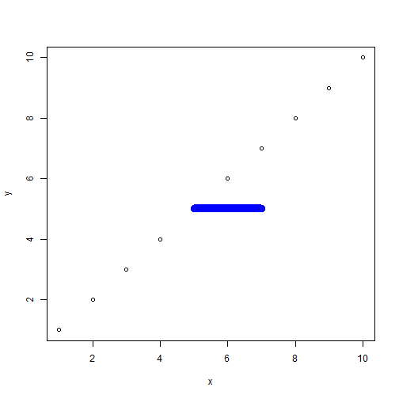 

```r
# 平末端
par(lend = 1)
plot(5, 5, )
segments(5, 5, 7, 5, lwd = 10, col = "blue")
abline(v = 5)
```

 

```r

# 平末端2
par(lend = 2)
plot(5, 5, col = "red")
segments(5, 5, 7, 5, lwd = 10, col = "blue")
abline(v = 5)
```

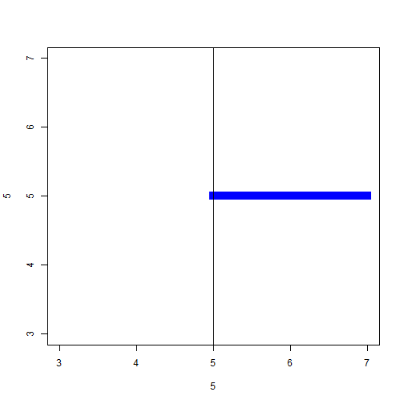 


## lheight-图中的文本行高
控制行间距

```r
par(lheight = 1)
plot(x, y)
text(4, 4, "how are you\n how are you")
par(lheight = 5)
text(8, 4, "how are you\nhow are you")
```

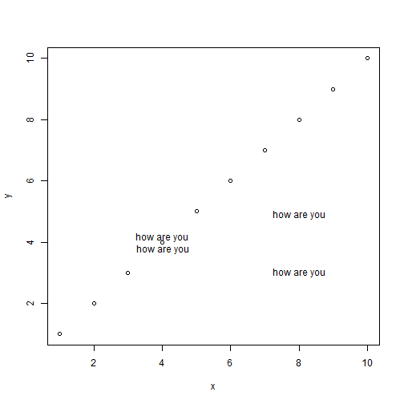 


## ljoin-线条相交处的样式
取值为0(round)圆角,1(mitre)方角,2(bevel)切掉顶角

```r
par(mfrow = c(2, 2), ljoin = 0, bg = "white")
plot(c(0, 4, 0), c(0, 1.5, 3), type = "l", lwd = 10)
par(ljoin = 1)
plot(c(0, 4, 0), c(0, 1.5, 3), type = "l", lwd = 10)
par(ljoin = 2)
plot(c(0, 4, 0), c(0, 1.5, 3), type = "l", lwd = 10)
```

 


## lty-线条的类型
每一本书上都有

```r
plot(x, y, type = "n")
abline(h = x, lty = x)
text(2, 1, "实线", col = "red")
text(2, 2, "虚线", col = "red")
text(2, 3, "点线", col = "red")
text(2, 4, "点划线", col = "red")
text(2, 5, "长划线", col = "red")
text(2, 6, "点长划线", col = "red")
```

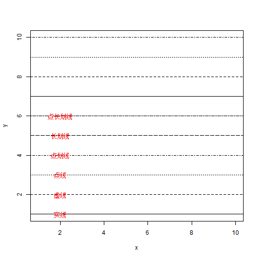 


## lwd-线的宽度
控制包括四周边框在内的线的宽度,可以单独设置

```r
par(lwd = 1)
plot(x, y, type = "l")
```

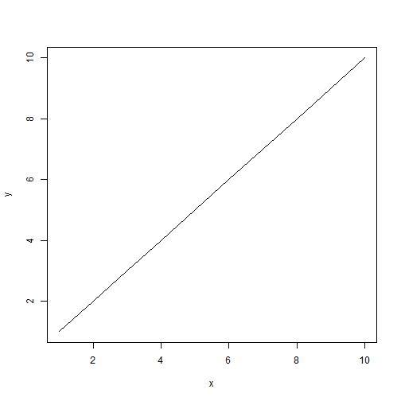 

```r
par(lwd = 5)
plot(x, y, type = "l")
segments(5, 5, 10, 20)
```

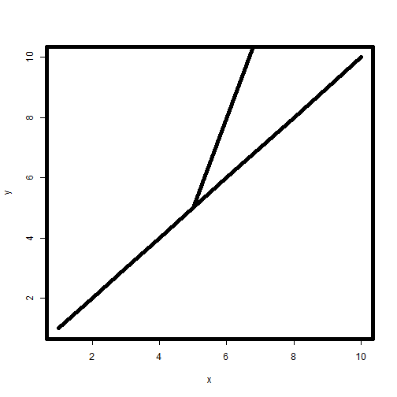 


## mex-设置坐标轴的边界宽度缩放倍数

```r
par(mfrow = c(2, 2), bg = "yellow", mex = 1)
plot(x, y)
par(mex = 1.5)
plot(x, y)
par(mex = 0.5)
plot(x, y)
```

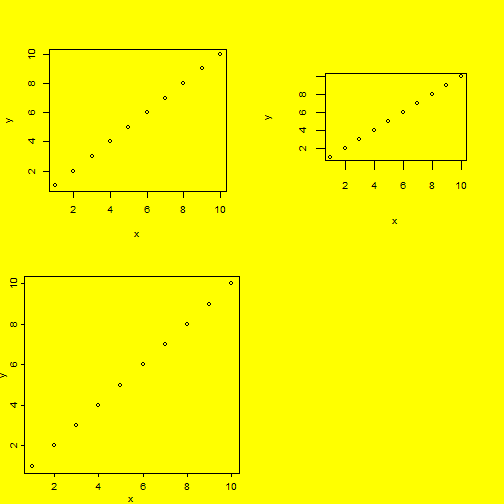 


## mfrow mfcol -设置一页多图

```r
par(mfrow = c(3, 3))
plot(x, y)
plot(x, y)
plot(x, y)
plot(x, y)
plot(x, y)
plot(x, y)
plot(x, y)
par(mfcol = c(1, 5))
```

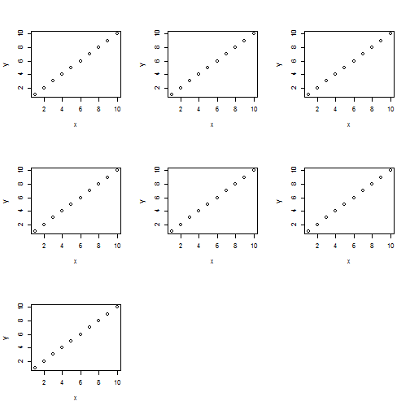 

```r
plot(x, y)
plot(x, y)
plot(x, y)
plot(x, y)
plot(x, y)
```

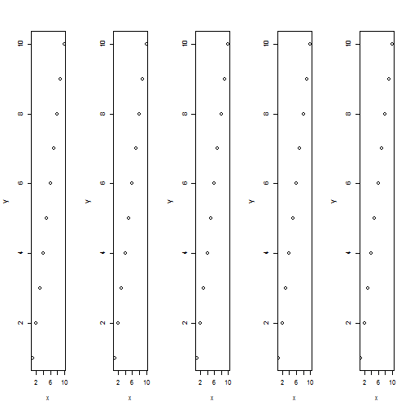 


## mgp-设置坐标轴的边界宽度
取值长度为3的数值向量，分别表示坐标轴标题,坐标轴刻度线标签和坐标轴先的边界宽度。默认为c(3,1,0)

```r
par(mfrow = c(2, 2), mgp = c(3, 1, 0))
plot(x, y)
par(mgp = c(1.5, 3, 1))
plot(x, y)
```

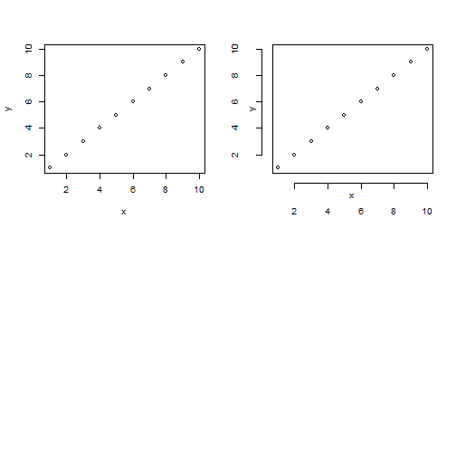 


## oma-设置外边界宽度(外边界)
类似mar，默认为c(0,0,0,0)
par 改变的是每一幅图的大小，可以控制多张图的一张图

```r
par(mgp = c(3, 1, 0), lwd = 1)
par(mfrow = c(2, 2))
plot(x, y)
par(mar = c(1, 1, 1, 1))
plot(x, y)

par(mfrow = c(2, 2), oma = c(0, 0, 0, 0))
```

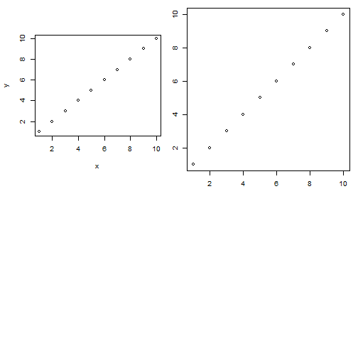 

```r
plot(x, y)
plot(x, y)
plot(x, y)
plot(x, y)
par(mfrow = c(2, 2), oma = c(0, 5, 5, 0))
plot(x, y)
plot(x, y)
plot(x, y)
plot(x, y)
```

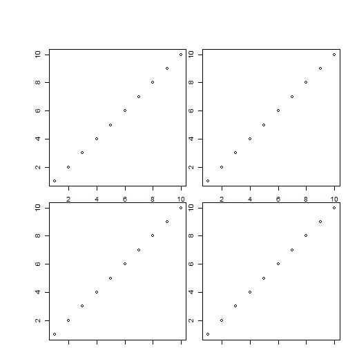 


## pch-点的符号
共有25种，可以单独设置

```r
plot(x, y, pch = x)
```

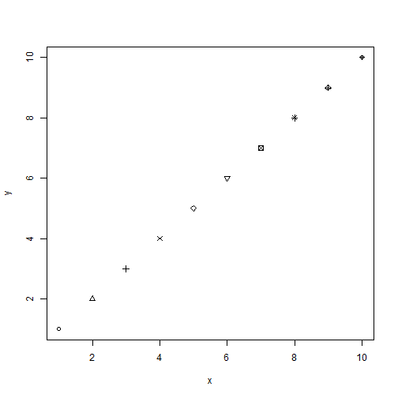 


## pty-设置作图区域的形状
默认为"m",尽可能最大化作图的区域，另外一种取值为"s",这只作图区域为正方形

```r
par(mfrow = c(2, 2), pty = "m")
plot(x, y)
plot(x, y)
plot(x, y)
plot(x, y)
par(mfrow = c(2, 2), pty = "s")
plot(x, y)
plot(x, y)
plot(x, y)
plot(x, y)
```

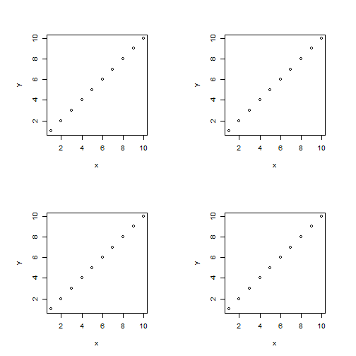 


## srt-字符串的旋转角度

```r
par(mfrow = c(1, 1), srt = 30)
plot(x, y)
text(5, 5, "how are you")
```

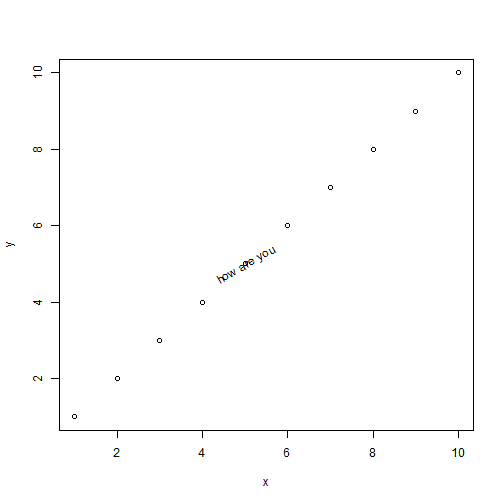 

```r
par(srt = 170)
plot(x, y)
text(5, 5, "how are you")
```

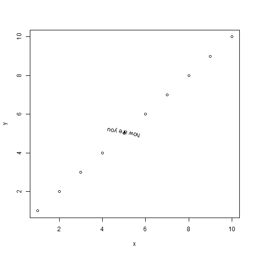 


## tck-坐标轴刻度线的高度、
也可单独设置,0表示没有，负值向外，正值向内。

```r
par(mar = c(4, 2, 2, 2))
plot(x, y)
par(tck = 0)
plot(x, y)
par(tck = -0.1)
plot(x, y)
```

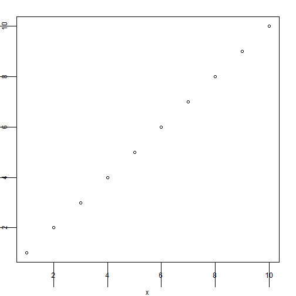 


## tcl-坐标轴刻度线的高度，取一个与文本行搞的比例值正负的意义和tck类似，默认为-0.5,即向外画线，高度为半行文本高。可以单独设置

```r
plot(x, y)
par(tcl = -0.5)
plot(x, y)
par(tcl = -1)
plot(x, y)
par(tcl = 1)
plot(x, y)
```

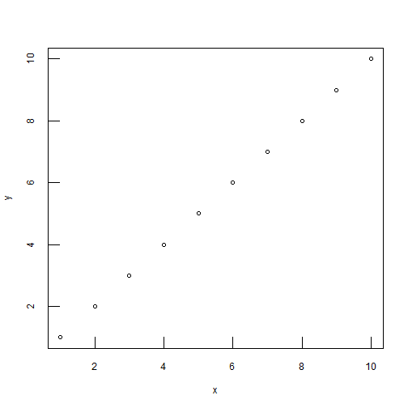 


## usr-作图区域的范围限制，取值长度为4的数值向量c(x1,x2,y1,y2),分别对应x的左右极限和y的上下极限???


```r
par(usr = c(50, 70, 30, 90))
x = 1:100
plot(x, x)
```

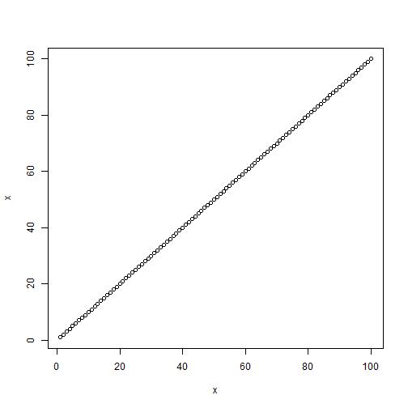 

## xaxs, yaxs 坐标轴范围的计算方式；默认’r’：
先把原始数据的范围向外扩大4%，然后用这个范围画坐标轴；另外一种取值’i’表示直接使用原始数据范围；实际上还有其它的坐标轴范围计算方式，但是鉴于它们目前在R中都尚未生效，所以暂不加介绍

```r
plot(x, x)
par(xaxs = "i", yaxs = "i")
plot(x, x)
```

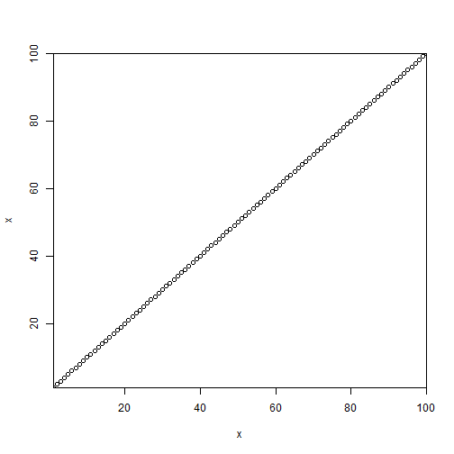 

## xaxt, yaxt 坐标轴样式；默认’s’为标准样式；另外一种取值’n’意思是不画坐标轴

## xpd
 对超出边界的图形的处理方式；取值FALSE：把图形限制在作图区域内，出界的图形截去；取值TRUE：把图形限制在图形区域内，出界的图形截去；取值NA：把图形限制在设备区域内。

