# chapter: Annotations
## 介绍
R Graphics Cookbook 第七章 Annotations 整理而来。
## 7.1.添加文本注释
用annotate()和text geom（文字对象）：如下：
annotate 里面用"text"类型，然后x,y分别代表文本的位置。label的内容是文本的实际内容。
annotate 中的类型
* text 文本
* rect 阴影矩形
* segment 线段
* pointrange (最后演示)

```r
library(ggplot2)
# 创建一个图层
p <- ggplot(faithful, aes(x = eruptions, y = waiting)) + geom_point()
# 在图层上添加文本
p + annotate("text", x = 3, y = 48, label = "Group 1") + annotate("text", x = 4.5, 
    y = 66, label = "Group 2")
```

 

我们可以设置文字的大小，字体，颜色等。如下：    

```r
p + annotate("text", x = 3, y = 48, label = "Group 1", family = "serif", fontface = "italic", 
    colour = "darkred", size = 5) + annotate("text", x = 4.5, y = 66, label = "Group 2", 
    family = "serif", fontface = "italic", colour = "darkred", size = 5)
```

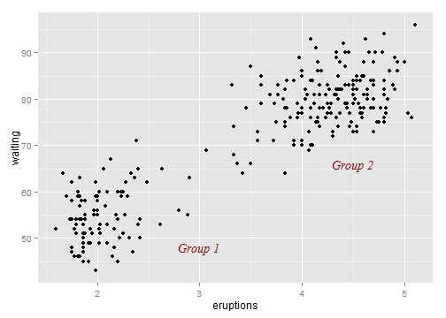 

我们也可以用geom_text来替代annotate

```r
p + annotate("text", x=3, y=48, label="Group 1", alpha=.1) +     # Normal
    geom_text(x=4.5, y=66, label="Group 2", alpha=.1)            # Overplotted
```

 

我们可以用Inf -Inf,来控制文本放在图像的边缘    
x=-Inf是左侧，x=Inf是右侧，y=-Inf是上方，y=Inf是下方
如果直接这样还可能无法看到文字，还要通过vjust和hjust的调整。

```r
q = p + annotate("text", x = -Inf, y = Inf, label = "Upper left", hjust = -0.2, 
    vjust = 2) + annotate("text", x = mean(range(faithful$eruptions)), y = -Inf, 
    vjust = -0.4, label = "Bottom middle")
q
```

 

```r
q + annotate("text", x = Inf, y = Inf, label = "Upper right", hjust = 2, vjust = 2) + 
    annotate("text", x = -Inf, y = -Inf, label = "Down left", hjust = -0.1, 
        vjust = -1) + annotate("text", x = Inf, y = -Inf, label = "Down right", 
    hjust = 2, vjust = -1)
```

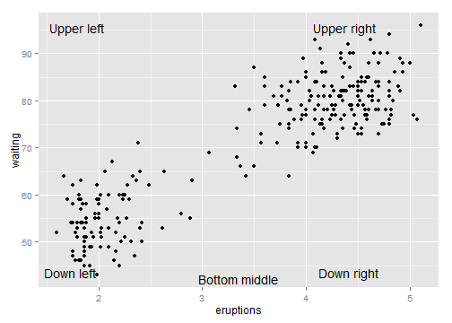 

## 7.2.在注释中添加数学公示
### 用基础作图系统中添加数学公示
用expression函数

```r
x = 1:10
plot(x, x)
# 乘
text(1, 9, expression(x * y), col = "red", cex = 1.5, adj = 0)
text(1, 8, expression(x %.% y), col = "red", cex = 1.5, adj = 0)
text(1, 7, expression(x %*% y), col = "red", cex = 1.5, adj = 0)
# 加和减
text(1, 6, expression(x %+-% y), col = "red", cex = 1.5, adj = 0)
# 下标
text(1, 5, expression(x[i]), col = "red", cex = 1.5, adj = 0)
# 指数
text(1, 4, expression(x^10), col = "red", cex = 1.5, adj = 0)
# 开方
text(1, 3, expression(sqrt(x)), col = "red", cex = 1.5, adj = 0)
text(1, 2, expression(sqrt(x, y)), col = "red", cex = 1.5, adj = 0)
# 除
text(1, 1, expression(x%/%y), col = "red", cex = 1.5, adj = 0)
# 关系型
text(3, 9, expression(x != y), col = "red", cex = 1.5, adj = 0)
text(3, 8, expression(x <= y), col = "red", cex = 1.5, adj = 0)
text(3, 7, expression(x %~~% y), col = "red", cex = 1.5, adj = 0)
text(3, 6, expression(x %=~% y), col = "red", cex = 1.5, adj = 0)
text(3, 5, expression(x %==% y), col = "red", cex = 1.5, adj = 0)
text(3, 4, expression(x %prop% y), col = "red", cex = 1.5, adj = 0)
# 字型
text(5, 9, expression(plain(xy)), col = "red", cex = 1.5, adj = 0)
text(5, 8, expression(italic(xy)), col = "red", cex = 1.5, adj = 0)
text(5, 7, expression(bold(xy)), col = "red", cex = 1.5, adj = 0)
text(5, 6, expression(bolditalic(xy)), col = "red", cex = 1.5, adj = 0)
text(5, 5, expression(underline(xy)), col = "red", cex = 1.5, adj = 0)
text(5, 4, expression(bar(xy)), col = "red", cex = 1.5, adj = 0)
```

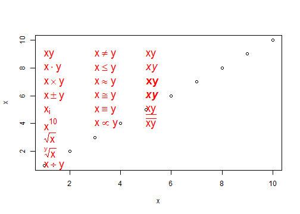 

```r
# 更多内容请看
demo(plotmath)
```

```
## 
## 
## 	demo(plotmath)
## 	---- ~~~~~~~~
## 
## > #  Copyright (C) 2002-2009 The R Core Team
## > 
## > require(datasets)
## 
## > require(grDevices); require(graphics)
## 
## > ## --- "math annotation" in plots :
## > 
## > ######
## > # create tables of mathematical annotation functionality
## > ######
## > make.table <- function(nr, nc) {
## +     savepar <- par(mar=rep(0, 4), pty="s")
## +     plot(c(0, nc*2 + 1), c(0, -(nr + 1)),
## +          type="n", xlab="", ylab="", axes=FALSE)
## +     savepar
## + }
## 
## > get.r <- function(i, nr) {
## +     i %% nr + 1
## + }
## 
## > get.c <- function(i, nr) {
## +     i %/% nr + 1
## + }
## 
## > draw.title.cell <- function(title, i, nr) {
## +     r <- get.r(i, nr)
## +     c <- get.c(i, nr)
## +     text(2*c - .5, -r, title)
## +     rect((2*(c - 1) + .5), -(r - .5), (2*c + .5), -(r + .5))
## + }
## 
## > draw.plotmath.cell <- function(expr, i, nr, string = NULL) {
## +     r <- get.r(i, nr)
## +     c <- get.c(i, nr)
## +     if (is.null(string)) {
## +         string <- deparse(expr)
## +         string <- substr(string, 12, nchar(string) - 1)
## +     }
## +     text((2*(c - 1) + 1), -r, string, col="grey")
## +     text((2*c), -r, expr, adj=c(.5,.5))
## +     rect((2*(c - 1) + .5), -(r - .5), (2*c + .5), -(r + .5), border="grey")
## + }
## 
## > nr <- 20
## 
## > nc <- 2
## 
## > oldpar <- make.table(nr, nc)
```

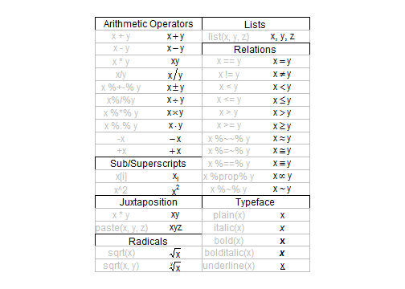 

```
## 
## > i <- 0
## 
## > draw.title.cell("Arithmetic Operators", i, nr); i <- i + 1
## 
## > draw.plotmath.cell(expression(x + y), i, nr); i <- i + 1
## 
## > draw.plotmath.cell(expression(x - y), i, nr); i <- i + 1
## 
## > draw.plotmath.cell(expression(x * y), i, nr); i <- i + 1
## 
## > draw.plotmath.cell(expression(x / y), i, nr); i <- i + 1
## 
## > draw.plotmath.cell(expression(x %+-% y), i, nr); i <- i + 1
## 
## > draw.plotmath.cell(expression(x %/% y), i, nr); i <- i + 1
## 
## > draw.plotmath.cell(expression(x %*% y), i, nr); i <- i + 1
## 
## > draw.plotmath.cell(expression(x %.% y), i, nr); i <- i + 1
## 
## > draw.plotmath.cell(expression(-x), i, nr); i <- i + 1
## 
## > draw.plotmath.cell(expression(+x), i, nr); i <- i + 1
## 
## > draw.title.cell("Sub/Superscripts", i, nr); i <- i + 1
## 
## > draw.plotmath.cell(expression(x[i]), i, nr); i <- i + 1
## 
## > draw.plotmath.cell(expression(x^2), i, nr); i <- i + 1
## 
## > draw.title.cell("Juxtaposition", i, nr); i <- i + 1
## 
## > draw.plotmath.cell(expression(x * y), i, nr); i <- i + 1
## 
## > draw.plotmath.cell(expression(paste(x, y, z)), i, nr); i <- i + 1
## 
## > draw.title.cell("Radicals", i, nr); i <- i + 1
## 
## > draw.plotmath.cell(expression(sqrt(x)), i, nr); i <- i + 1
## 
## > draw.plotmath.cell(expression(sqrt(x, y)), i, nr); i <- i + 1
## 
## > draw.title.cell("Lists", i, nr); i <- i + 1
## 
## > draw.plotmath.cell(expression(list(x, y, z)), i, nr); i <- i + 1
## 
## > draw.title.cell("Relations", i, nr); i <- i + 1
## 
## > draw.plotmath.cell(expression(x == y), i, nr); i <- i + 1
## 
## > draw.plotmath.cell(expression(x != y), i, nr); i <- i + 1
## 
## > draw.plotmath.cell(expression(x < y), i, nr); i <- i + 1
## 
## > draw.plotmath.cell(expression(x <= y), i, nr); i <- i + 1
## 
## > draw.plotmath.cell(expression(x > y), i, nr); i <- i + 1
## 
## > draw.plotmath.cell(expression(x >= y), i, nr); i <- i + 1
## 
## > draw.plotmath.cell(expression(x %~~% y), i, nr); i <- i + 1
## 
## > draw.plotmath.cell(expression(x %=~% y), i, nr); i <- i + 1
## 
## > draw.plotmath.cell(expression(x %==% y), i, nr); i <- i + 1
## 
## > draw.plotmath.cell(expression(x %prop% y), i, nr); i <- i + 1
## 
## > draw.plotmath.cell(expression(x %~% y), i, nr); i <- i + 1
## 
## > draw.title.cell("Typeface", i, nr); i <- i + 1
## 
## > draw.plotmath.cell(expression(plain(x)), i, nr); i <- i + 1
## 
## > draw.plotmath.cell(expression(italic(x)), i, nr); i <- i + 1
## 
## > draw.plotmath.cell(expression(bold(x)), i, nr); i <- i + 1
## 
## > draw.plotmath.cell(expression(bolditalic(x)), i, nr); i <- i + 1
## 
## > draw.plotmath.cell(expression(underline(x)), i, nr); i <- i + 1
## 
## > # Need fewer, wider columns for ellipsis ...
## > nr <- 20
## 
## > nc <- 2
## 
## > make.table(nr, nc)
```

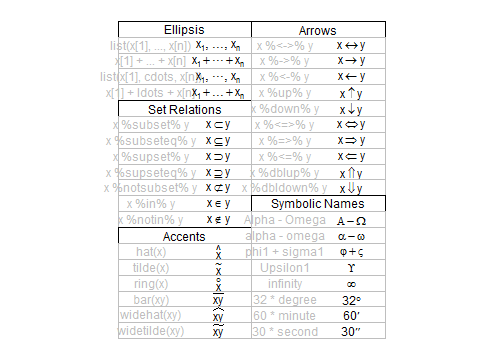 

```
## $mar
## [1] 0 0 0 0
## 
## $pty
## [1] "s"
## 
## 
## > i <- 0
## 
## > draw.title.cell("Ellipsis", i, nr); i <- i + 1
## 
## > draw.plotmath.cell(expression(list(x[1], ..., x[n])), i, nr); i <- i + 1
## 
## > draw.plotmath.cell(expression(x[1] + ... + x[n]), i, nr); i <- i + 1
## 
## > draw.plotmath.cell(expression(list(x[1], cdots, x[n])), i, nr); i <- i + 1
## 
## > draw.plotmath.cell(expression(x[1] + ldots + x[n]), i, nr); i <- i + 1
## 
## > draw.title.cell("Set Relations", i, nr); i <- i + 1
## 
## > draw.plotmath.cell(expression(x %subset% y), i, nr); i <- i + 1
## 
## > draw.plotmath.cell(expression(x %subseteq% y), i, nr); i <- i + 1
## 
## > draw.plotmath.cell(expression(x %supset% y), i, nr); i <- i + 1
## 
## > draw.plotmath.cell(expression(x %supseteq% y), i, nr); i <- i + 1
## 
## > draw.plotmath.cell(expression(x %notsubset% y), i, nr); i <- i + 1
## 
## > draw.plotmath.cell(expression(x %in% y), i, nr); i <- i + 1
## 
## > draw.plotmath.cell(expression(x %notin% y), i, nr); i <- i + 1
## 
## > draw.title.cell("Accents", i, nr); i <- i + 1
## 
## > draw.plotmath.cell(expression(hat(x)), i, nr); i <- i + 1
## 
## > draw.plotmath.cell(expression(tilde(x)), i, nr); i <- i + 1
## 
## > draw.plotmath.cell(expression(ring(x)), i, nr); i <- i + 1
## 
## > draw.plotmath.cell(expression(bar(xy)), i, nr); i <- i + 1
## 
## > draw.plotmath.cell(expression(widehat(xy)), i, nr); i <- i + 1
## 
## > draw.plotmath.cell(expression(widetilde(xy)), i, nr); i <- i + 1
## 
## > draw.title.cell("Arrows", i, nr); i <- i + 1
## 
## > draw.plotmath.cell(expression(x %<->% y), i, nr); i <- i + 1
## 
## > draw.plotmath.cell(expression(x %->% y), i, nr); i <- i + 1
## 
## > draw.plotmath.cell(expression(x %<-% y), i, nr); i <- i + 1
## 
## > draw.plotmath.cell(expression(x %up% y), i, nr); i <- i + 1
## 
## > draw.plotmath.cell(expression(x %down% y), i, nr); i <- i + 1
## 
## > draw.plotmath.cell(expression(x %<=>% y), i, nr); i <- i + 1
## 
## > draw.plotmath.cell(expression(x %=>% y), i, nr); i <- i + 1
## 
## > draw.plotmath.cell(expression(x %<=% y), i, nr); i <- i + 1
## 
## > draw.plotmath.cell(expression(x %dblup% y), i, nr); i <- i + 1
## 
## > draw.plotmath.cell(expression(x %dbldown% y), i, nr); i <- i + 1
## 
## > draw.title.cell("Symbolic Names", i, nr); i <- i + 1
## 
## > draw.plotmath.cell(expression(Alpha - Omega), i, nr); i <- i + 1
## 
## > draw.plotmath.cell(expression(alpha - omega), i, nr); i <- i + 1
## 
## > draw.plotmath.cell(expression(phi1 + sigma1), i, nr); i <- i + 1
## 
## > draw.plotmath.cell(expression(Upsilon1), i, nr); i <- i + 1
## 
## > draw.plotmath.cell(expression(infinity), i, nr); i <- i + 1
## 
## > draw.plotmath.cell(expression(32 * degree), i, nr); i <- i + 1
## 
## > draw.plotmath.cell(expression(60 * minute), i, nr); i <- i + 1
## 
## > draw.plotmath.cell(expression(30 * second), i, nr); i <- i + 1
## 
## > # Need even fewer, wider columns for typeface and style ...
## > nr <- 20
## 
## > nc <- 1
## 
## > make.table(nr, nc)
```

```
## $mar
## [1] 0 0 0 0
## 
## $pty
## [1] "s"
## 
## 
## > i <- 0
## 
## > draw.title.cell("Style", i, nr); i <- i + 1
## 
## > draw.plotmath.cell(expression(displaystyle(x)), i, nr); i <- i + 1
## 
## > draw.plotmath.cell(expression(textstyle(x)), i, nr); i <- i + 1
## 
## > draw.plotmath.cell(expression(scriptstyle(x)), i, nr); i <- i + 1
## 
## > draw.plotmath.cell(expression(scriptscriptstyle(x)), i, nr); i <- i + 1
## 
## > draw.title.cell("Spacing", i, nr); i <- i + 1
## 
## > draw.plotmath.cell(expression(x ~~ y), i, nr); i <- i + 1
## 
## > # Need fewer, taller rows for fractions ...
## > # cheat a bit to save pages
## > par(new = TRUE)
## 
## > nr <- 10
## 
## > nc <- 1
## 
## > make.table(nr, nc)
```

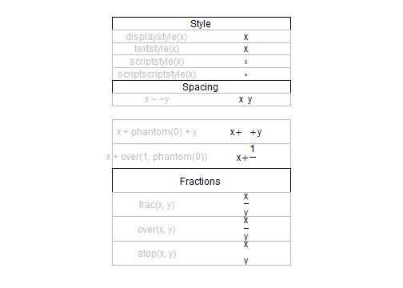 

```
## $mar
## [1] 0 0 0 0
## 
## $pty
## [1] "s"
## 
## 
## > i <- 4
## 
## > draw.plotmath.cell(expression(x + phantom(0) + y), i, nr); i <- i + 1
## 
## > draw.plotmath.cell(expression(x + over(1, phantom(0))), i, nr); i <- i + 1
## 
## > draw.title.cell("Fractions", i, nr); i <- i + 1
## 
## > draw.plotmath.cell(expression(frac(x, y)), i, nr); i <- i + 1
## 
## > draw.plotmath.cell(expression(over(x, y)), i, nr); i <- i + 1
## 
## > draw.plotmath.cell(expression(atop(x, y)), i, nr); i <- i + 1
## 
## > # Need fewer, taller rows and fewer, wider columns for big operators ...
## > nr <- 10
## 
## > nc <- 1
## 
## > make.table(nr, nc)
```

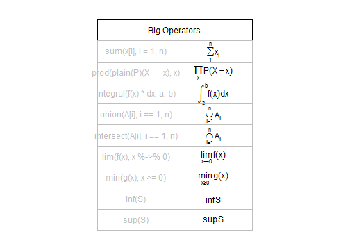 

```
## $mar
## [1] 0 0 0 0
## 
## $pty
## [1] "s"
## 
## 
## > i <- 0
## 
## > draw.title.cell("Big Operators", i, nr); i <- i + 1
## 
## > draw.plotmath.cell(expression(sum(x[i], i=1, n)), i, nr); i <- i + 1
## 
## > draw.plotmath.cell(expression(prod(plain(P)(X == x), x)), i, nr); i <- i + 1
## 
## > draw.plotmath.cell(expression(integral(f(x) * dx, a, b)), i, nr); i <- i + 1
## 
## > draw.plotmath.cell(expression(union(A[i], i==1, n)), i, nr); i <- i + 1
## 
## > draw.plotmath.cell(expression(intersect(A[i], i==1, n)), i, nr); i <- i + 1
## 
## > draw.plotmath.cell(expression(lim(f(x), x %->% 0)), i, nr); i <- i + 1
## 
## > draw.plotmath.cell(expression(min(g(x), x >= 0)), i, nr); i <- i + 1
## 
## > draw.plotmath.cell(expression(inf(S)), i, nr); i <- i + 1
## 
## > draw.plotmath.cell(expression(sup(S)), i, nr); i <- i + 1
## 
## > make.table(nr, nc)
```

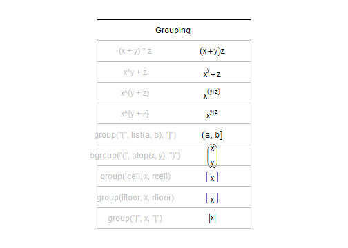 

```
## $mar
## [1] 0 0 0 0
## 
## $pty
## [1] "s"
## 
## 
## > i <- 0
## 
## > draw.title.cell("Grouping", i, nr); i <- i + 1
## 
## > draw.plotmath.cell(expression((x + y)*z), i, nr); i <- i + 1
## 
## > draw.plotmath.cell(expression(x^y + z), i, nr); i <- i + 1
## 
## > draw.plotmath.cell(expression(x^(y + z)), i, nr); i <- i + 1
## 
## > # have to do this one by hand
## > draw.plotmath.cell(expression(x^{y + z}), i, nr, string="x^{y + z}"); i <- i + 1
## 
## > draw.plotmath.cell(expression(group("(", list(a, b), "]")), i, nr); i <- i + 1
## 
## > draw.plotmath.cell(expression(bgroup("(", atop(x, y), ")")), i, nr); i <- i + 1
## 
## > draw.plotmath.cell(expression(group(lceil, x, rceil)), i, nr); i <- i + 1
## 
## > draw.plotmath.cell(expression(group(lfloor, x, rfloor)), i, nr); i <- i + 1
## 
## > draw.plotmath.cell(expression(group("|", x, "|")), i, nr); i <- i + 1
## 
## > par(oldpar)
```

### ggplot中添加数学公示
ggplot 中的数学表达形式和R基础作图的形式是一样的。

```r
# 正态曲线
p <- ggplot(data.frame(x = c(-3, 3)), aes(x = x)) + stat_function(fun = dnorm)
# 用annotate 中的'text',然后要使parse=TRUE
p + annotate("text", x = 2, y = 0.3, parse = TRUE, label = "frac(1, sqrt(2 * pi)) * e ^ {-x^2 / 2}")
```

 

```r
p + annotate("text", x = 0, y = 0.2, label = "x^2")
```

 

```r
p + annotate("text", x = 0, y = 0.2, parse = TRUE, label = "x^2")
```

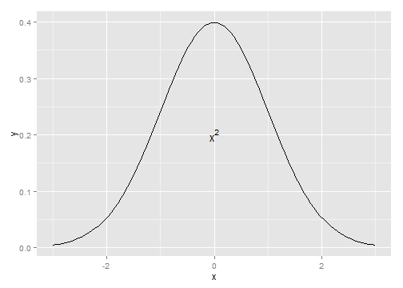 

```r

# 公式的两部分
p + annotate("text", x = 0, y = 0.05, parse = TRUE, size = 4, label = "Function: \t   y==frac(1, sqrt(2*pi)) * e^{-x^2/2}")
```

 

```r
# 用*在两部分之间进行连接 普通的文字用单引号引起来
p + annotate("text", x = 0, y = 0.05, parse = TRUE, size = 4, label = "'Function:  ' * y==frac(1, sqrt(2*pi)) * e^{-x^2/2}")
```

 

## 7.3.添加直线
### 基础系统中的直线

```r
plot(x, x)
abline(v = 5)
abline(h = 5)
# 添加斜线
abline(0, 1)  # 添加斜率为1,截距为0的斜线
abline(1, 1)  # 添加斜率为1,截距为0的斜线
```

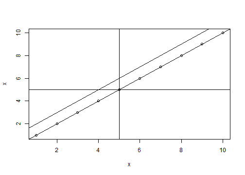 

### ggplot2中的直线

```r
library(gcookbook)  # For the data set

p <- ggplot(heightweight, aes(x = ageYear, y = heightIn, colour = sex)) + geom_point()

# 用geom_hline添加水平直线 用geom_vline添加竖直直线
p + geom_hline(yintercept = 60) + geom_vline(xintercept = 14)
```

 

```r

# 添加任意斜率的 intercept控制截距，slope控制斜率
p + geom_abline(intercept = 37.4, slope = 1.75)
```

 

```r

# 除了我们直接赋值给xintercept 和yintercept以外，
# 我们还可以从数据中给他们赋值
library(plyr)  # For the ddply() function
# 统计了不同性别的高度的平均值
hw_means <- ddply(heightweight, "sex", summarise, heightIn = mean(heightIn))
hw_means
```

```
##   sex heightIn
## 1   f    60.53
## 2   m    62.06
```

```r
`?`(linetype)
```

```
## starting httpd help server ... done
```

```r
p + geom_hline(aes(yintercept = heightIn, colour = sex), data = hw_means, linetype = "dashed", 
    size = 1)
```

 

```r
# 线的类型 0 = blank, 1 = solid, 2 = dashed, 3 = dotted, 4 = dotdash, 5 =
# longdash, 6 = twodash
p + geom_vline(xintercept = 12, linetype = "blank") + geom_vline(xintercept = 13, 
    linetype = "solid") + geom_vline(xintercept = 14, linetype = "dotted") + 
    geom_vline(xintercept = 15, linetype = "dotdash") + geom_vline(xintercept = 16, 
    linetype = "longdash") + geom_vline(xintercept = 17, linetype = "twodash")
```

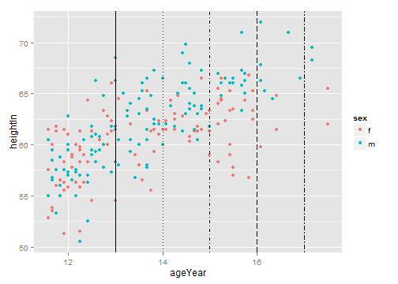 

```r

# 处理坐标是离散形的
pg <- ggplot(PlantGrowth, aes(x = group, y = weight)) + geom_point()
pg
```

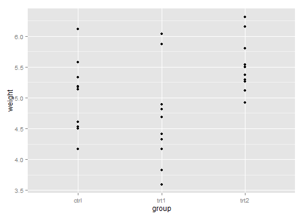 

```r
# 我们要给trt1这竖列添加竖线 首先我们要看一下几个离散量的level
levels(PlantGrowth$group)
```

```
## [1] "ctrl" "trt1" "trt2"
```

```r
# 结果中'ctrl','trt1','trt2'从做往右我们分别可以用1,2,3,...表示
pg + geom_vline(xintercept = 2)
```

 

```r
# 还可以用更聪明的办法
pg + geom_vline(xintercept = which(levels(PlantGrowth$group) == "ctrl"))
```

 

## 7.4.添加线段和箭头

```r
library(gcookbook)  # For the data set

p <- ggplot(subset(climate, Source == "Berkeley"), aes(x = Year, y = Anomaly10y)) + 
    geom_line()

p + annotate("segment", x = 1950, xend = 1980, y = -0.25, yend = -0.25)
```

 

```r


library(grid)
p + annotate("segment", x = 1850, xend = 1820, y = -0.8, yend = -0.95, colour = "blue", 
    size = 2, arrow = arrow()) + annotate("segment", x = 1950, xend = 1980, 
    y = -0.25, yend = -0.25, arrow = arrow(ends = "both", angle = 90, length = unit(0.2, 
        "cm")))
```

 

## 7.5.添加矩形阴影

```r
library(gcookbook)  # For the data set

p <- ggplot(subset(climate, Source == "Berkeley"), aes(x = Year, y = Anomaly10y)) + 
    geom_line()

p + annotate("rect", xmin = 1950, xmax = 1980, ymin = -1, ymax = 1, alpha = 0.1, 
    fill = "blue")
```

 

## 7.6.高亮某个元素

```r
pg <- PlantGrowth  # Make a copy of the PlantGrowth data
pg$hl <- "no"  # Set all to 'no'
pg$hl[pg$group == "trt2"] <- "yes"  # If group is 'trt2', set to 'yes'


ggplot(pg, aes(x = group, y = weight, fill = hl)) + geom_boxplot() + scale_fill_manual(values = c("grey85", 
    "#FFDDCC"), guide = FALSE)
```

 

```r


ggplot(PlantGrowth, aes(x = group, y = weight, fill = group)) + geom_boxplot() + 
    scale_fill_manual(values = c("grey85", "grey85", "#FFDDCC"), guide = FALSE)
```

 

## 7.7.添加误差线

```r
library(gcookbook)  # For the data set
# Take a subset of the cabbage_exp data for this example
ce <- subset(cabbage_exp, Cultivar == "c39")

# With a bar graph
ggplot(ce, aes(x = Date, y = Weight)) + geom_bar(fill = "white", colour = "black") + 
    geom_errorbar(aes(ymin = Weight - se, ymax = Weight + se), width = 0.2)
```

```
## Mapping a variable to y and also using stat="bin".
##   With stat="bin", it will attempt to set the y value to the count of cases in each group.
##   This can result in unexpected behavior and will not be allowed in a future version of ggplot2.
##   If you want y to represent counts of cases, use stat="bin" and don't map a variable to y.
##   If you want y to represent values in the data, use stat="identity".
##   See ?geom_bar for examples. (Deprecated; last used in version 0.9.2)
```

 

```r

# With a line graph
ggplot(ce, aes(x = Date, y = Weight)) + geom_line(aes(group = 1)) + geom_point(size = 4) + 
    geom_errorbar(aes(ymin = Weight - se, ymax = Weight + se), width = 0.2)
```

 

```r
ce
```

```
##   Cultivar Date Weight     sd  n      se
## 1      c39  d16   3.18 0.9566 10 0.30251
## 2      c39  d20   2.80 0.2789 10 0.08819
## 3      c39  d21   2.74 0.9834 10 0.31098
```

```r

cabbage_exp
```

```
##   Cultivar Date Weight     sd  n      se
## 1      c39  d16   3.18 0.9566 10 0.30251
## 2      c39  d20   2.80 0.2789 10 0.08819
## 3      c39  d21   2.74 0.9834 10 0.31098
## 4      c52  d16   2.26 0.4452 10 0.14079
## 5      c52  d20   3.11 0.7909 10 0.25009
## 6      c52  d21   1.47 0.2111 10 0.06675
```

```r

# Bad: dodge width not specified
ggplot(cabbage_exp, aes(x = Date, y = Weight, fill = Cultivar)) + geom_bar(position = "dodge") + 
    geom_errorbar(aes(ymin = Weight - se, ymax = Weight + se), position = "dodge", 
        width = 0.2)
```

```
## Mapping a variable to y and also using stat="bin".
##   With stat="bin", it will attempt to set the y value to the count of cases in each group.
##   This can result in unexpected behavior and will not be allowed in a future version of ggplot2.
##   If you want y to represent counts of cases, use stat="bin" and don't map a variable to y.
##   If you want y to represent values in the data, use stat="identity".
##   See ?geom_bar for examples. (Deprecated; last used in version 0.9.2)
```

 

```r

# Good: dodge width set to same as bar width (0.9)
ggplot(cabbage_exp, aes(x = Date, y = Weight, fill = Cultivar)) + geom_bar(position = "dodge") + 
    geom_errorbar(aes(ymin = Weight - se, ymax = Weight + se), position = position_dodge(0.9), 
        width = 0.2)
```

```
## Mapping a variable to y and also using stat="bin".
##   With stat="bin", it will attempt to set the y value to the count of cases in each group.
##   This can result in unexpected behavior and will not be allowed in a future version of ggplot2.
##   If you want y to represent counts of cases, use stat="bin" and don't map a variable to y.
##   If you want y to represent values in the data, use stat="identity".
##   See ?geom_bar for examples. (Deprecated; last used in version 0.9.2)
```

 

```r


pd <- position_dodge(0.3)  # Save the dodge spec because we use it repeatedly

ggplot(cabbage_exp, aes(x = Date, y = Weight, colour = Cultivar, group = Cultivar)) + 
    geom_errorbar(aes(ymin = Weight - se, ymax = Weight + se), width = 0.2, 
        size = 0.25, colour = "black", position = pd) + geom_line(position = pd) + 
    geom_point(position = pd, size = 2.5)
```

```
## ymax not defined: adjusting position using y instead
## ymax not defined: adjusting position using y instead
```

 

```r

# Thinner error bar lines with size=0.25, and larger points with size=2.5
```

## 7.8.向单个面板中添加注释

```r
# The base plot
p <- ggplot(mpg, aes(x = displ, y = hwy)) + geom_point() + facet_grid(. ~ drv)

# A data frame with labels for each facet
f_labels <- data.frame(drv = c("4", "f", "r"), label = c("4wd", "Front", "Rear"))

p + geom_text(x = 6, y = 40, aes(label = label), data = f_labels)
```

 

```r

# If you use annotate(), the label will appear in all facets
p + annotate("text", x = 6, y = 42, label = "label text")
```

 

```r

# This function returns a data frame with strings representing the
# regression equation, and the r^2 value These strings will be treated as R
# math expressions
lm_labels <- function(dat) {
    mod <- lm(hwy ~ displ, data = dat)
    formula <- sprintf("italic(y) == %.2f %+.2f * italic(x)", round(coef(mod)[1], 
        2), round(coef(mod)[2], 2))
    
    r <- cor(dat$displ, dat$hwy)
    r2 <- sprintf("italic(R^2) == %.2f", r^2)
    data.frame(formula = formula, r2 = r2, stringsAsFactors = FALSE)
}

library(plyr)  # For the ddply() function
labels <- ddply(mpg, "drv", lm_labels)
labels
```

```
##   drv                              formula                  r2
## 1   4 italic(y) == 30.68 -2.88 * italic(x) italic(R^2) == 0.65
## 2   f italic(y) == 37.38 -3.60 * italic(x) italic(R^2) == 0.36
## 3   r italic(y) == 25.78 -0.92 * italic(x) italic(R^2) == 0.04
```

```r

# Plot with formula and R^2 values
p + geom_smooth(method = lm, se = FALSE) + geom_text(x = 3, y = 40, aes(label = formula), 
    data = labels, parse = TRUE, hjust = 0) + geom_text(x = 3, y = 35, aes(label = r2), 
    data = labels, parse = TRUE, hjust = 0)
```

 

```r

# Find r^2 values for each group
labels <- ddply(mpg, "drv", summarise, r2 = cor(displ, hwy)^2)
labels$r2 <- sprintf("italic(R^2) == %.2f", labels$r2)
```


## 添加pointrange

```r
p + annotate("pointrange", x = 3.5, y = 20, ymin = 12, ymax = 28, colour = "red", 
    size = 1.5)
```

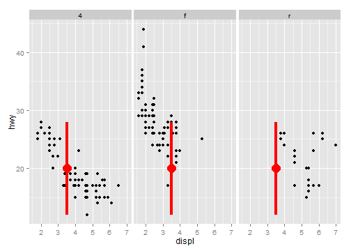 


##  
p + annotate("text", x = 2:3, y = 20:21, label = c("my label", "label 2"))
