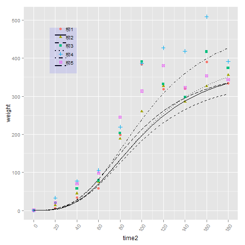

```r
library(ggplot2)
library(scales)

data <- read.table("a.csv", sep = ",", header = TRUE)

class(data$time)
```

```
## [1] "factor"
```

```r
data$time = as.Date(data$time)
class(data$time)
```

```
## [1] "Date"
```

```r
start = as.Date("2011-04-13")
data$time1 = data$time - start
data$time2 = as.numeric(data$time1)

head(data)
```

```
##         time weight type    time1 time2
## 1 2011-04-13   0.02  柳1   0 days     0
## 2 2011-05-03   6.30  柳1  20 days    20
## 3 2011-05-23  34.20  柳1  40 days    40
## 4 2011-06-12  58.35  柳1  60 days    60
## 5 2011-07-02 198.40  柳1  80 days    80
## 6 2011-07-22 383.85  柳1 100 days   100
```

```r
myfun = function(xvar) {
    390.4 - 390.38/(1 + (xvar/99.544)^3)
}
ggplot(data, aes(time2, weight, shape = type, colour = type)) + geom_line() + 
    geom_point(size = 2.5) + scale_x_continuous(breaks = seq(0, 180, by = 20)) + 
    theme(axis.text.x = element_text(angle = 60, hjust = 1)) + stat_function(fun = myfun, 
    geom = "line", colour = "black", size = 1)
```

```
## Warning: 'mbcsToSbcs'里转换'����<U+3E33>1'出错：<e6>代替了dot
## Warning: 'mbcsToSbcs'里转换'����<U+3E33>1'出错：<9f>代替了dot
## Warning: 'mbcsToSbcs'里转换'����<U+3E33>1'出错：<b3>代替了dot
## Warning: 'mbcsToSbcs'里转换'����<U+3E33>2'出错：<e6>代替了dot
## Warning: 'mbcsToSbcs'里转换'����<U+3E33>2'出错：<9f>代替了dot
## Warning: 'mbcsToSbcs'里转换'����<U+3E33>2'出错：<b3>代替了dot
## Warning: 'mbcsToSbcs'里转换'����<U+3E33>3'出错：<e6>代替了dot
## Warning: 'mbcsToSbcs'里转换'����<U+3E33>3'出错：<9f>代替了dot
## Warning: 'mbcsToSbcs'里转换'����<U+3E33>3'出错：<b3>代替了dot
## Warning: 'mbcsToSbcs'里转换'����<U+3E33>4'出错：<e6>代替了dot
## Warning: 'mbcsToSbcs'里转换'����<U+3E33>4'出错：<9f>代替了dot
## Warning: 'mbcsToSbcs'里转换'����<U+3E33>4'出错：<b3>代替了dot
## Warning: 'mbcsToSbcs'里转换'����<U+3E33>5'出错：<e6>代替了dot
## Warning: 'mbcsToSbcs'里转换'����<U+3E33>5'出错：<9f>代替了dot
## Warning: 'mbcsToSbcs'里转换'����<U+3E33>5'出错：<b3>代替了dot
## Warning: 'mbcsToSbcs'里转换'����<U+3E33>1'出错：<e6>代替了dot
## Warning: 'mbcsToSbcs'里转换'����<U+3E33>1'出错：<9f>代替了dot
## Warning: 'mbcsToSbcs'里转换'����<U+3E33>1'出错：<b3>代替了dot
## Warning: 'mbcsToSbcs'里转换'����<U+3E33>2'出错：<e6>代替了dot
## Warning: 'mbcsToSbcs'里转换'����<U+3E33>2'出错：<9f>代替了dot
## Warning: 'mbcsToSbcs'里转换'����<U+3E33>2'出错：<b3>代替了dot
## Warning: 'mbcsToSbcs'里转换'����<U+3E33>3'出错：<e6>代替了dot
## Warning: 'mbcsToSbcs'里转换'����<U+3E33>3'出错：<9f>代替了dot
## Warning: 'mbcsToSbcs'里转换'����<U+3E33>3'出错：<b3>代替了dot
## Warning: 'mbcsToSbcs'里转换'����<U+3E33>4'出错：<e6>代替了dot
## Warning: 'mbcsToSbcs'里转换'����<U+3E33>4'出错：<9f>代替了dot
## Warning: 'mbcsToSbcs'里转换'����<U+3E33>4'出错：<b3>代替了dot
## Warning: 'mbcsToSbcs'里转换'����<U+3E33>5'出错：<e6>代替了dot
## Warning: 'mbcsToSbcs'里转换'����<U+3E33>5'出错：<9f>代替了dot
## Warning: 'mbcsToSbcs'里转换'����<U+3E33>5'出错：<b3>代替了dot
## Warning: 'mbcsToSbcs'里转换'����<U+3E33>1'出错：<e6>代替了dot
## Warning: 'mbcsToSbcs'里转换'����<U+3E33>1'出错：<9f>代替了dot
## Warning: 'mbcsToSbcs'里转换'����<U+3E33>1'出错：<b3>代替了dot
## Warning: 'mbcsToSbcs'里转换'����<U+3E33>2'出错：<e6>代替了dot
## Warning: 'mbcsToSbcs'里转换'����<U+3E33>2'出错：<9f>代替了dot
## Warning: 'mbcsToSbcs'里转换'����<U+3E33>2'出错：<b3>代替了dot
## Warning: 'mbcsToSbcs'里转换'����<U+3E33>3'出错：<e6>代替了dot
## Warning: 'mbcsToSbcs'里转换'����<U+3E33>3'出错：<9f>代替了dot
## Warning: 'mbcsToSbcs'里转换'����<U+3E33>3'出错：<b3>代替了dot
## Warning: 'mbcsToSbcs'里转换'����<U+3E33>4'出错：<e6>代替了dot
## Warning: 'mbcsToSbcs'里转换'����<U+3E33>4'出错：<9f>代替了dot
## Warning: 'mbcsToSbcs'里转换'����<U+3E33>4'出错：<b3>代替了dot
## Warning: 'mbcsToSbcs'里转换'����<U+3E33>5'出错：<e6>代替了dot
## Warning: 'mbcsToSbcs'里转换'����<U+3E33>5'出错：<9f>代替了dot
## Warning: 'mbcsToSbcs'里转换'����<U+3E33>5'出错：<b3>代替了dot
```

 

# 下面讲了横坐标为时间的时候的划分

```r
ggplot(data, aes(time1, weight, shape = type, colour = type)) + geom_line() + 
    geom_point(size = 2.5) + scale_x_date(breaks = date_breaks("20 days"), labels = date_format("%m-%d")) + 
    theme(axis.text.x = element_text(angle = 60, hjust = 1))
```

```
## Error: Invalid input: date_trans works with objects of class Date only
```

```r
# stat_function(fun=myfun,geom='line')
```

