# need

```r
# 单个箱线图
boxplot(mtcars$mpg)
b = boxplot.stats(mtcars$mpg)$stats
b
```

```
## [1] 10.40 15.35 19.20 22.80 33.90
```

```r
text(1, b, format(b))
```

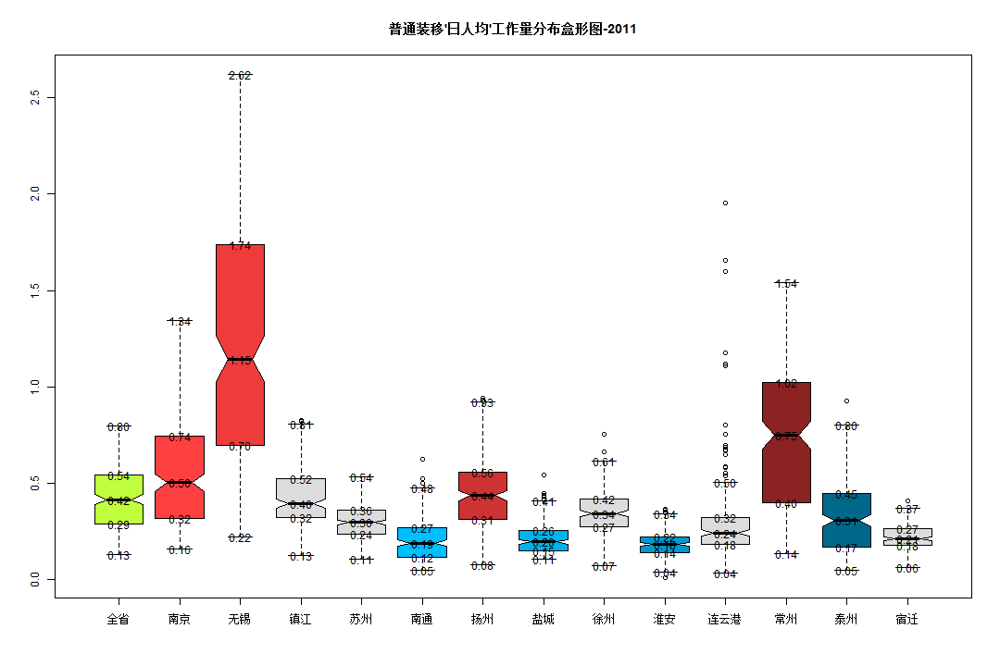 

```r

# 多个箱线图
c = boxplot(mpg ~ cyl, data = mtcars)$stats
c
```

```
##      [,1]  [,2] [,3]
## [1,] 21.4 17.80 13.3
## [2,] 22.8 18.65 14.3
## [3,] 26.0 19.70 15.2
## [4,] 30.4 21.00 16.4
## [5,] 33.9 21.40 19.2
```

```r
xpos = rep(1:3, each = 5)
xpos
```

```
##  [1] 1 1 1 1 1 2 2 2 2 2 3 3 3 3 3
```

```r
text(xpos, c, format(c))
```

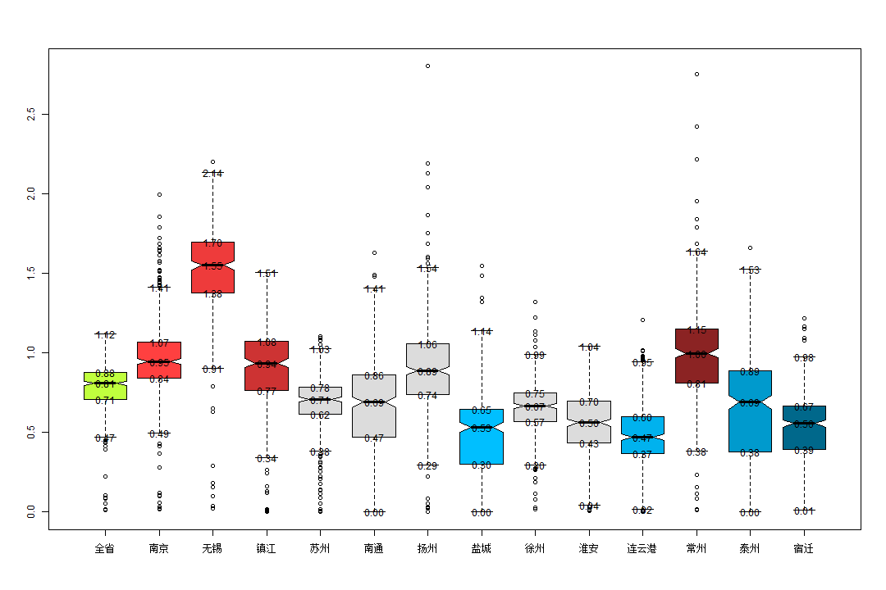 

# help

```r
require(grDevices)  # for colours
tN <- table(Ni <- stats::rpois(100, lambda = 5))
tN
```

```
## 
##  0  1  2  3  4  5  6  7  8  9 10 11 12 14 
##  2  2 10  8 14 24 13 10  6  5  2  2  1  1
```

```r
r <- barplot(tN, col = rainbow(20))
# - type = 'h' plotting *is* 'bar'plot
lines(r, tN, type = "h", col = "red", lwd = 2)
```

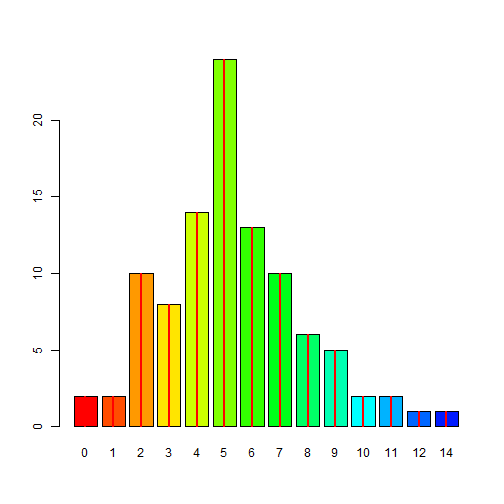 

```r

barplot(tN, space = 1.5, axisnames = FALSE, sub = "barplot(..., space= 1.5, axisnames = FALSE)")
```

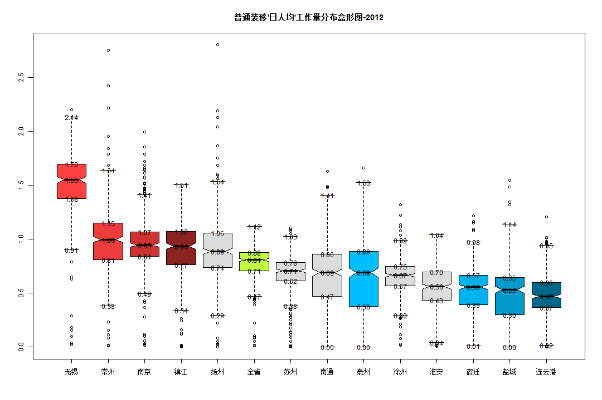 

```r

barplot(VADeaths, plot = FALSE)
```

```
## [1] 0.7 1.9 3.1 4.3
```

```r
barplot(VADeaths, plot = FALSE, beside = TRUE)
```

```
##      [,1] [,2] [,3] [,4]
## [1,]  1.5  7.5 13.5 19.5
## [2,]  2.5  8.5 14.5 20.5
## [3,]  3.5  9.5 15.5 21.5
## [4,]  4.5 10.5 16.5 22.5
## [5,]  5.5 11.5 17.5 23.5
```

```r

VADeaths
```

```
##       Rural Male Rural Female Urban Male Urban Female
## 50-54       11.7          8.7       15.4          8.4
## 55-59       18.1         11.7       24.3         13.6
## 60-64       26.9         20.3       37.0         19.3
## 65-69       41.0         30.9       54.6         35.1
## 70-74       66.0         54.3       71.1         50.0
```

```r
mp <- barplot(VADeaths)  # default
mp
```

```
## [1] 0.7 1.9 3.1 4.3
```

```r
tot <- colMeans(VADeaths)
mode(tot)
```

```
## [1] "numeric"
```

```r
class(tot)
```

```
## [1] "numeric"
```

```r
format(tot)
```

```
##   Rural Male Rural Female   Urban Male Urban Female 
##      "32.74"      "25.18"      "40.48"      "25.28"
```

```r
text(mp, tot + 3, format(tot), xpd = TRUE, col = "blue")
text(0.7, 39, 39, xpd = TRUE, col = "red")
```

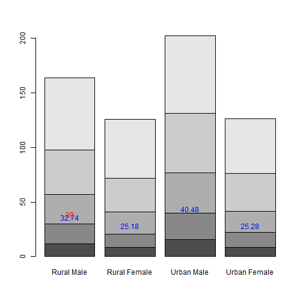 

```r
barplot(VADeaths, beside = TRUE, col = c("lightblue", "mistyrose", "lightcyan", 
    "lavender", "cornsilk"), legend = rownames(VADeaths), ylim = c(0, 100))
title(main = "Death Rates in Virginia", font.main = 4)
```

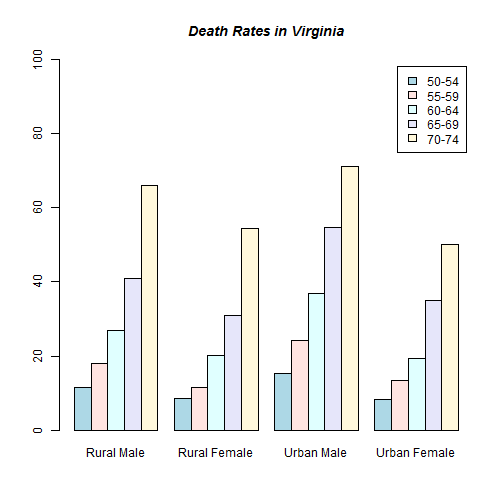 

```r

hh <- t(VADeaths)[, 5:1]
mybarcol <- "gray20"
mp <- barplot(hh, beside = TRUE, col = c("lightblue", "mistyrose", "lightcyan", 
    "lavender"), legend = colnames(VADeaths), ylim = c(0, 100), main = "Death Rates in Virginia", 
    font.main = 4, sub = "Faked upper 2*sigma error bars", col.sub = mybarcol, 
    cex.names = 1.5)
segments(mp, hh, mp, hh + 2 * sqrt(1000 * hh/100), col = mybarcol, lwd = 1.5)
stopifnot(dim(mp) == dim(hh))  # corresponding matrices
mtext(side = 1, at = colMeans(mp), line = -2, text = paste("Mean", formatC(colMeans(hh))), 
    col = "red")
```

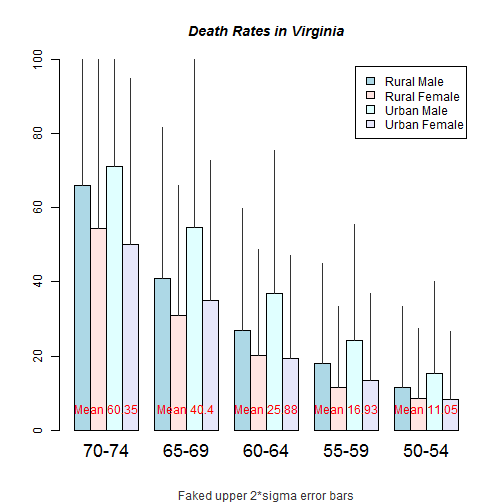 

```r

# Bar shading example
barplot(VADeaths, angle = 15 + 10 * 1:5, density = 20, col = "black", legend = rownames(VADeaths))
title(main = list("Death Rates in Virginia", font = 4))
```

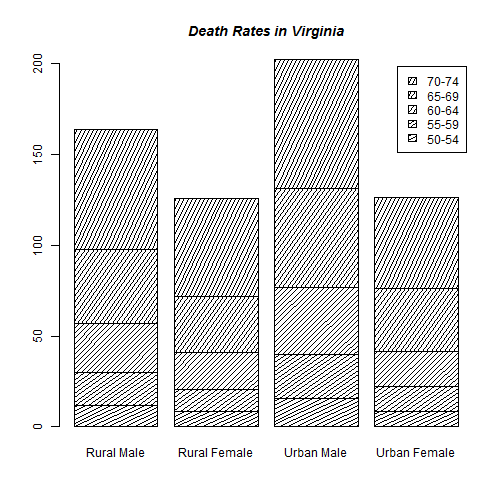 

```r

# border :
barplot(VADeaths, border = "dark blue")
```

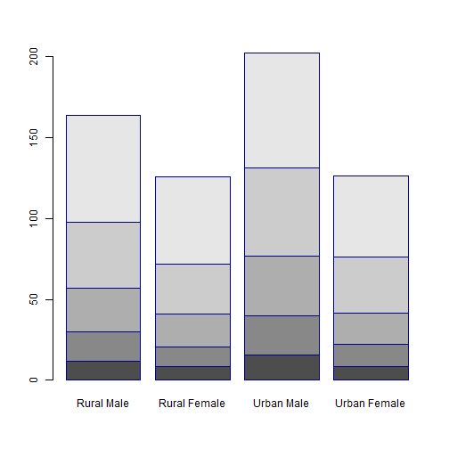 

```r


# log scales (not much sense here):
barplot(tN, col = heat.colors(12), log = "y")
```

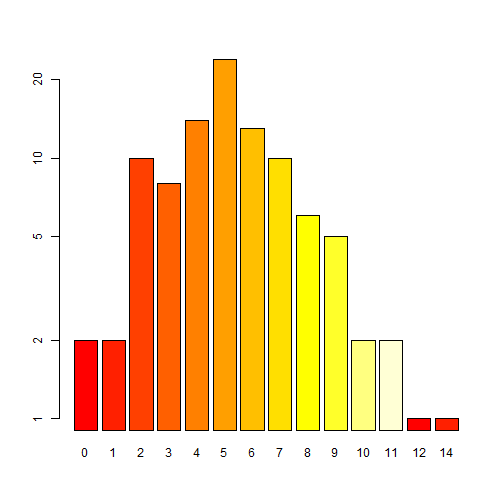 

```r
barplot(tN, col = gray.colors(20), log = "xy")
```

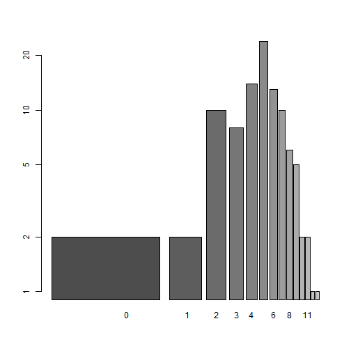 

```r

# args.legend
barplot(height = cbind(x = c(465, 91)/465 * 100, y = c(840, 200)/840 * 100, 
    z = c(37, 17)/37 * 100), beside = FALSE, width = c(465, 840, 37), col = c(1, 
    2), legend.text = c("A", "B"), args.legend = list(x = "topleft"))
```

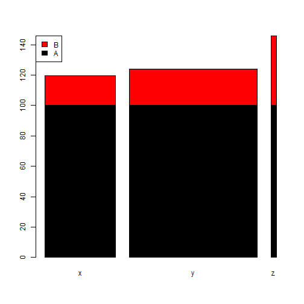 


