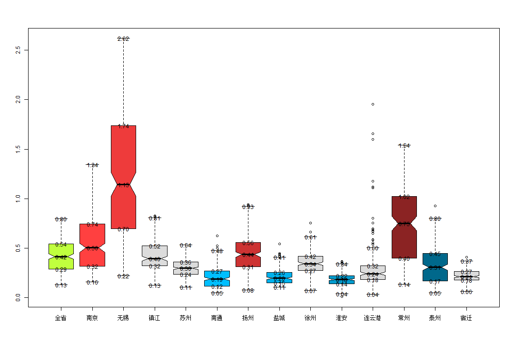

```r
library(reshape)
```

```
## Loading required package: plyr
## 
## Attaching package: 'reshape'
## 
## 下列对象被屏蔽了from 'package:plyr':
## 
##     rename, round_any
```

```r
data.FZY = read.table("a.csv", sep = ",", header = TRUE)
data.RenShu = read.table("b.csv", sep = ",", header = TRUE)
names_city = names(data.RenShu)
data.FZY2011 = subset(data.FZY, 年份 == 2011)
for (i in 3:length(names_city)) {
    name = names_city[i]
    data.FZY2011[, name] = data.FZY2011[, name]/data.RenShu[1, name]
}
data.FZY2011_1 = melt(data.FZY2011, id = c("X", "月份", "年份", "装移机情况"))
value = boxplot(value ~ variable, data = data.FZY2011_1, varwidth = TRUE, notch = TRUE, 
    col = rainbow(16))$stats
```

```
## Warning: 'mbcsToSbcs'里转换'��ㄧ��'出错：<e5>代替了dot
## Warning: 'mbcsToSbcs'里转换'��ㄧ��'出错：<85>代替了dot
## Warning: 'mbcsToSbcs'里转换'��ㄧ��'出错：<a8>代替了dot
## Warning: 'mbcsToSbcs'里转换'��ㄧ��'出错：<e7>代替了dot
## Warning: 'mbcsToSbcs'里转换'��ㄧ��'出错：<9c>代替了dot
## Warning: 'mbcsToSbcs'里转换'��ㄧ��'出错：<81>代替了dot
## Warning: 'mbcsToSbcs'里转换'��ㄧ��'出错：<e5>代替了dot
## Warning: 'mbcsToSbcs'里转换'��ㄧ��'出错：<85>代替了dot
## Warning: 'mbcsToSbcs'里转换'��ㄧ��'出错：<a8>代替了dot
## Warning: 'mbcsToSbcs'里转换'��ㄧ��'出错：<e7>代替了dot
## Warning: 'mbcsToSbcs'里转换'��ㄧ��'出错：<9c>代替了dot
## Warning: 'mbcsToSbcs'里转换'��ㄧ��'出错：<81>代替了dot
## Warning: 'mbcsToSbcs'里转换'���浜�'出错：<e5>代替了dot
## Warning: 'mbcsToSbcs'里转换'���浜�'出错：<8d>代替了dot
## Warning: 'mbcsToSbcs'里转换'���浜�'出错：<97>代替了dot
## Warning: 'mbcsToSbcs'里转换'���浜�'出错：<e4>代替了dot
## Warning: 'mbcsToSbcs'里转换'���浜�'出错：<ba>代替了dot
## Warning: 'mbcsToSbcs'里转换'���浜�'出错：<ac>代替了dot
## Warning: 'mbcsToSbcs'里转换'������'出错：<e6>代替了dot
## Warning: 'mbcsToSbcs'里转换'������'出错：<97>代替了dot
## Warning: 'mbcsToSbcs'里转换'������'出错：<a0>代替了dot
## Warning: 'mbcsToSbcs'里转换'������'出错：<e9>代替了dot
## Warning: 'mbcsToSbcs'里转换'������'出错：<94>代替了dot
## Warning: 'mbcsToSbcs'里转换'������'出错：<a1>代替了dot
## Warning: 'mbcsToSbcs'里转换'������'出错：<e6>代替了dot
## Warning: 'mbcsToSbcs'里转换'������'出错：<97>代替了dot
## Warning: 'mbcsToSbcs'里转换'������'出错：<a0>代替了dot
## Warning: 'mbcsToSbcs'里转换'������'出错：<e9>代替了dot
## Warning: 'mbcsToSbcs'里转换'������'出错：<94>代替了dot
## Warning: 'mbcsToSbcs'里转换'������'出错：<a1>代替了dot
## Warning: 'mbcsToSbcs'里转换'���姹�'出错：<e9>代替了dot
## Warning: 'mbcsToSbcs'里转换'���姹�'出错：<95>代替了dot
## Warning: 'mbcsToSbcs'里转换'���姹�'出错：<87>代替了dot
## Warning: 'mbcsToSbcs'里转换'���姹�'出错：<e6>代替了dot
## Warning: 'mbcsToSbcs'里转换'���姹�'出错：<b1>代替了dot
## Warning: 'mbcsToSbcs'里转换'���姹�'出错：<9f>代替了dot
## Warning: 'mbcsToSbcs'里转换'���宸�'出错：<e8>代替了dot
## Warning: 'mbcsToSbcs'里转换'���宸�'出错：<8b>代替了dot
## Warning: 'mbcsToSbcs'里转换'���宸�'出错：<8f>代替了dot
## Warning: 'mbcsToSbcs'里转换'���宸�'出错：<e5>代替了dot
## Warning: 'mbcsToSbcs'里转换'���宸�'出错：<b7>代替了dot
## Warning: 'mbcsToSbcs'里转换'���宸�'出错：<9e>代替了dot
## Warning: 'mbcsToSbcs'里转换'���宸�'出错：<e8>代替了dot
## Warning: 'mbcsToSbcs'里转换'���宸�'出错：<8b>代替了dot
## Warning: 'mbcsToSbcs'里转换'���宸�'出错：<8f>代替了dot
## Warning: 'mbcsToSbcs'里转换'���宸�'出错：<e5>代替了dot
## Warning: 'mbcsToSbcs'里转换'���宸�'出错：<b7>代替了dot
## Warning: 'mbcsToSbcs'里转换'���宸�'出错：<9e>代替了dot
## Warning: 'mbcsToSbcs'里转换'�����<U+393C><U+3E61>'出错：<e5>代替了dot
## Warning: 'mbcsToSbcs'里转换'�����<U+393C><U+3E61>'出错：<8d>代替了dot
## Warning: 'mbcsToSbcs'里转换'�����<U+393C><U+3E61>'出错：<97>代替了dot
## Warning: 'mbcsToSbcs'里转换'�����<U+393C><U+3E61>'出错：<e9>代替了dot
## Warning: 'mbcsToSbcs'里转换'�����<U+393C><U+3E61>'出错：<80>代替了dot
## Warning: 'mbcsToSbcs'里转换'�����<U+393C><U+3E61>'出错：<9a>代替了dot
## Warning: 'mbcsToSbcs'里转换'���宸�'出错：<e6>代替了dot
## Warning: 'mbcsToSbcs'里转换'���宸�'出错：<89>代替了dot
## Warning: 'mbcsToSbcs'里转换'���宸�'出错：<ac>代替了dot
## Warning: 'mbcsToSbcs'里转换'���宸�'出错：<e5>代替了dot
## Warning: 'mbcsToSbcs'里转换'���宸�'出错：<b7>代替了dot
## Warning: 'mbcsToSbcs'里转换'���宸�'出错：<9e>代替了dot
## Warning: 'mbcsToSbcs'里转换'���宸�'出错：<e6>代替了dot
## Warning: 'mbcsToSbcs'里转换'���宸�'出错：<89>代替了dot
## Warning: 'mbcsToSbcs'里转换'���宸�'出错：<ac>代替了dot
## Warning: 'mbcsToSbcs'里转换'���宸�'出错：<e5>代替了dot
## Warning: 'mbcsToSbcs'里转换'���宸�'出错：<b7>代替了dot
## Warning: 'mbcsToSbcs'里转换'���宸�'出错：<9e>代替了dot
## Warning: 'mbcsToSbcs'里转换'������'出错：<e7>代替了dot
## Warning: 'mbcsToSbcs'里转换'������'出错：<9b>代替了dot
## Warning: 'mbcsToSbcs'里转换'������'出错：<90>代替了dot
## Warning: 'mbcsToSbcs'里转换'������'出错：<e5>代替了dot
## Warning: 'mbcsToSbcs'里转换'������'出错：<9f>代替了dot
## Warning: 'mbcsToSbcs'里转换'������'出错：<8e>代替了dot
## Warning: 'mbcsToSbcs'里转换'寰�宸�'出错：<e5>代替了dot
## Warning: 'mbcsToSbcs'里转换'寰�宸�'出错：<be>代替了dot
## Warning: 'mbcsToSbcs'里转换'寰�宸�'出错：<90>代替了dot
## Warning: 'mbcsToSbcs'里转换'寰�宸�'出错：<e5>代替了dot
## Warning: 'mbcsToSbcs'里转换'寰�宸�'出错：<b7>代替了dot
## Warning: 'mbcsToSbcs'里转换'寰�宸�'出错：<9e>代替了dot
## Warning: 'mbcsToSbcs'里转换'寰�宸�'出错：<e5>代替了dot
## Warning: 'mbcsToSbcs'里转换'寰�宸�'出错：<be>代替了dot
## Warning: 'mbcsToSbcs'里转换'寰�宸�'出错：<90>代替了dot
## Warning: 'mbcsToSbcs'里转换'寰�宸�'出错：<e5>代替了dot
## Warning: 'mbcsToSbcs'里转换'寰�宸�'出错：<b7>代替了dot
## Warning: 'mbcsToSbcs'里转换'寰�宸�'出错：<9e>代替了dot
## Warning: 'mbcsToSbcs'里转换'娣�瀹�'出错：<e6>代替了dot
## Warning: 'mbcsToSbcs'里转换'娣�瀹�'出错：<b7>代替了dot
## Warning: 'mbcsToSbcs'里转换'娣�瀹�'出错：<ae>代替了dot
## Warning: 'mbcsToSbcs'里转换'娣�瀹�'出错：<e5>代替了dot
## Warning: 'mbcsToSbcs'里转换'娣�瀹�'出错：<ae>代替了dot
## Warning: 'mbcsToSbcs'里转换'娣�瀹�'出错：<89>代替了dot
## Warning: 'mbcsToSbcs'里转换'杩�浜�娓��<U+3E66>'出错：<e8>代替了dot
## Warning: 'mbcsToSbcs'里转换'杩�浜�娓��<U+3E66>'出错：<bf>代替了dot
## Warning: 'mbcsToSbcs'里转换'杩�浜�娓��<U+3E66>'出错：<9e>代替了dot
## Warning: 'mbcsToSbcs'里转换'杩�浜�娓��<U+3E66>'出错：<e4>代替了dot
## Warning: 'mbcsToSbcs'里转换'杩�浜�娓��<U+3E66>'出错：<ba>代替了dot
## Warning: 'mbcsToSbcs'里转换'杩�浜�娓��<U+3E66>'出错：<91>代替了dot
## Warning: 'mbcsToSbcs'里转换'杩�浜�娓��<U+3E66>'出错：<e6>代替了dot
## Warning: 'mbcsToSbcs'里转换'杩�浜�娓��<U+3E66>'出错：<b8>代替了dot
## Warning: 'mbcsToSbcs'里转换'杩�浜�娓��<U+3E66>'出错：<af>代替了dot
## Warning: 'mbcsToSbcs'里转换'杩�浜�娓��<U+3E66>'出错：<e8>代替了dot
## Warning: 'mbcsToSbcs'里转换'杩�浜�娓��<U+3E66>'出错：<bf>代替了dot
## Warning: 'mbcsToSbcs'里转换'杩�浜�娓��<U+3E66>'出错：<9e>代替了dot
## Warning: 'mbcsToSbcs'里转换'杩�浜�娓��<U+3E66>'出错：<e4>代替了dot
## Warning: 'mbcsToSbcs'里转换'杩�浜�娓��<U+3E66>'出错：<ba>代替了dot
## Warning: 'mbcsToSbcs'里转换'杩�浜�娓��<U+3E66>'出错：<91>代替了dot
## Warning: 'mbcsToSbcs'里转换'杩�浜�娓��<U+3E66>'出错：<e6>代替了dot
## Warning: 'mbcsToSbcs'里转换'杩�浜�娓��<U+3E66>'出错：<b8>代替了dot
## Warning: 'mbcsToSbcs'里转换'杩�浜�娓��<U+3E66>'出错：<af>代替了dot
## Warning: 'mbcsToSbcs'里转换'甯稿��'出错：<e5>代替了dot
## Warning: 'mbcsToSbcs'里转换'甯稿��'出错：<b8>代替了dot
## Warning: 'mbcsToSbcs'里转换'甯稿��'出错：<b8>代替了dot
## Warning: 'mbcsToSbcs'里转换'甯稿��'出错：<e5>代替了dot
## Warning: 'mbcsToSbcs'里转换'甯稿��'出错：<b7>代替了dot
## Warning: 'mbcsToSbcs'里转换'甯稿��'出错：<9e>代替了dot
## Warning: 'mbcsToSbcs'里转换'娉板��'出错：<e6>代替了dot
## Warning: 'mbcsToSbcs'里转换'娉板��'出错：<b3>代替了dot
## Warning: 'mbcsToSbcs'里转换'娉板��'出错：<b0>代替了dot
## Warning: 'mbcsToSbcs'里转换'娉板��'出错：<e5>代替了dot
## Warning: 'mbcsToSbcs'里转换'娉板��'出错：<b7>代替了dot
## Warning: 'mbcsToSbcs'里转换'娉板��'出错：<9e>代替了dot
## Warning: 'mbcsToSbcs'里转换'娉板��'出错：<e6>代替了dot
## Warning: 'mbcsToSbcs'里转换'娉板��'出错：<b3>代替了dot
## Warning: 'mbcsToSbcs'里转换'娉板��'出错：<b0>代替了dot
## Warning: 'mbcsToSbcs'里转换'娉板��'出错：<e5>代替了dot
## Warning: 'mbcsToSbcs'里转换'娉板��'出错：<b7>代替了dot
## Warning: 'mbcsToSbcs'里转换'娉板��'出错：<9e>代替了dot
## Warning: 'mbcsToSbcs'里转换'瀹胯��'出错：<e5>代替了dot
## Warning: 'mbcsToSbcs'里转换'瀹胯��'出错：<ae>代替了dot
## Warning: 'mbcsToSbcs'里转换'瀹胯��'出错：<bf>代替了dot
## Warning: 'mbcsToSbcs'里转换'瀹胯��'出错：<e8>代替了dot
## Warning: 'mbcsToSbcs'里转换'瀹胯��'出错：<bf>代替了dot
## Warning: 'mbcsToSbcs'里转换'瀹胯��'出错：<81>代替了dot
```

```r
text(1:14, t(value), sprintf("%.2f", t(value)))
```

 

