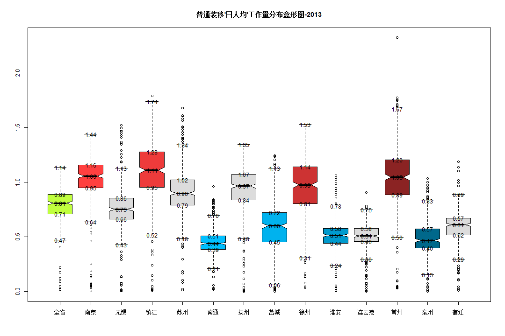

```r
library(reshape)
```

```
## Loading required package: plyr
## 
## Attaching package: 'reshape'
## 
## 下列对象被屏蔽了from 'package:plyr':
## 
##     rename, round_any
```

```r
data.FZY = read.table("a.csv", sep = ",", header = TRUE)
data.RenShu = read.table("b.csv", sep = ",", header = TRUE)
names_city = names(data.RenShu)
year = c("2011", "2012", "2013")
for (j in 1:3) {
    data.FZY2011 = subset(data.FZY, 年份 == year[j])
    for (i in 3:length(names_city)) {
        name = names_city[i]
        data.FZY2011[, name] = data.FZY2011[, name]/data.RenShu[j, name]
    }
    data.FZY2011_1 = melt(data.FZY2011, id = c("X", "月份", "年份", "装移机情况"))
    # value=boxplot(value~variable,data=data.FZY2011_1,varwidth=TRUE,notch=TRUE,col=rainbow(16))$stats
    value = boxplot(value ~ variable, data = data.FZY2011_1, plot = FALSE)$stats
    colnames(value) = boxplot(value ~ sort(variable), data = data.FZY2011_1, 
        plot = FALSE)$names
    rownames(value) = c("lower", "one_quarter", "median", "three_quarters", 
        "upper")
    value = as.data.frame(t(value))
    
    # top4 颜色
    value$colour[value$three_quarters >= sort(value$three_quarters)[11]] = c("brown1", 
        "brown2", "brown3", "brown4")
    # bottom4 颜色
    value$colour[value$one_quarter <= sort(value$one_quarter)[4]] = c("deepskyblue1", 
        "deepskyblue2", "deepskyblue3", "deepskyblue4")
    # other 颜色
    value$colour[value$three_quarters < sort(value$three_quarters)[11] & value$one_quarter > 
        sort(value$one_quarter)[4]] = c("olivedrab1", rep("gainsboro", 5))
    # 画图
    boxplot(value ~ sort(variable), data = data.FZY2011_1, varwidth = TRUE, 
        notch = TRUE, col = value$colour)
    text(1:14, as.matrix(value[1:14, 1:5]), sprintf("%.2f", as.matrix(value[1:14, 
        1:5])))
}
```

   

# 排序


