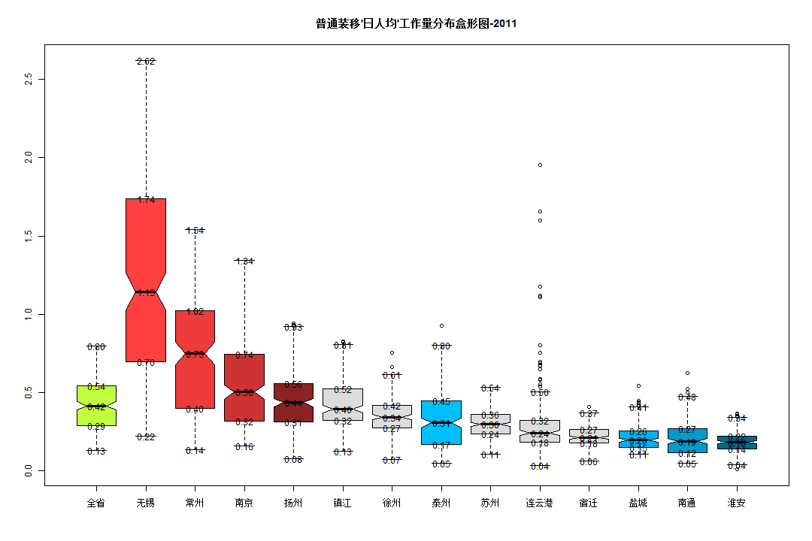
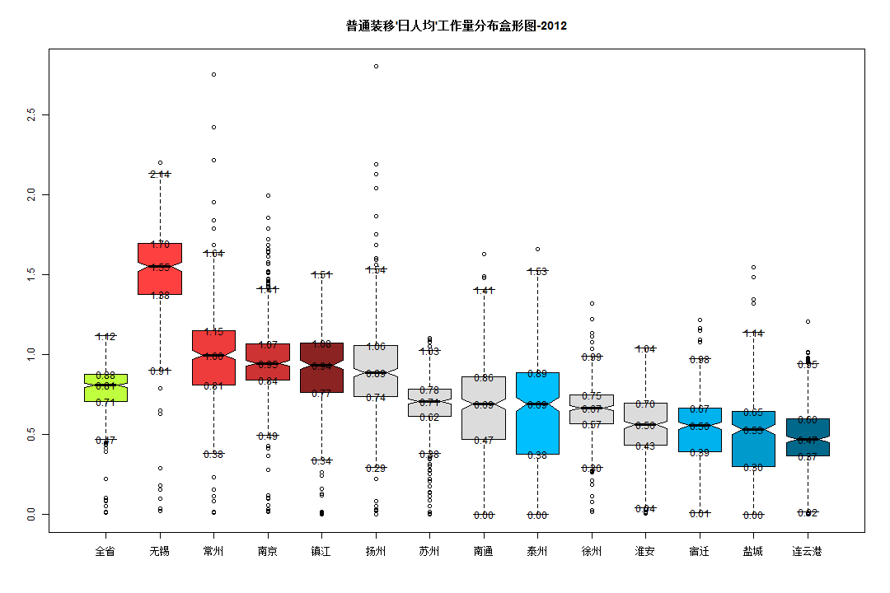
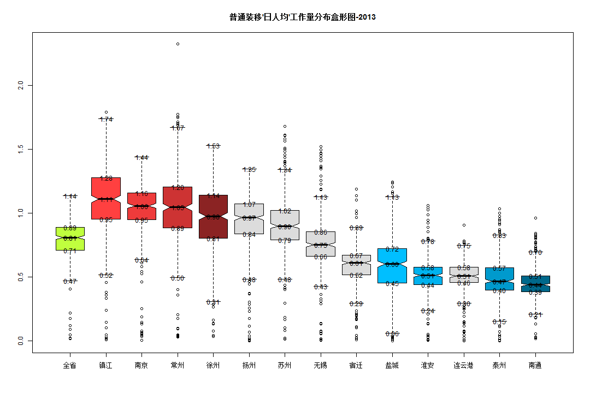

```r
library(reshape)
```

```
## Loading required package: plyr
## 
## Attaching package: 'reshape'
## 
## 下列对象被屏蔽了from 'package:plyr':
## 
##     rename, round_any
```

```r
data.FZY = read.table("a.csv", sep = ",", header = TRUE)
data.RenShu = read.table("b.csv", sep = ",", header = TRUE)
names_city = names(data.RenShu)
year = c("2011", "2012", "2013")
for (j in 1:3) {
    data.FZY2011 = subset(data.FZY, 年份 == year[j])
    for (i in 3:length(names_city)) {
        name = names_city[i]
        data.FZY2011[, name] = data.FZY2011[, name]/data.RenShu[j, name]
    }
    data.FZY2011_1 = melt(data.FZY2011, id = c("X", "月份", "年份", "装移机情况"))
    # value=boxplot(value~variable,data=data.FZY2011_1,varwidth=TRUE,notch=TRUE,col=rainbow(16))$stats
    value = boxplot(value ~ variable, data = data.FZY2011_1, plot = FALSE)$stats
    colnames(value) = boxplot(value ~ sort(variable), data = data.FZY2011_1, 
        plot = FALSE)$names
    rownames(value) = c("lower", "one_quarter", "median", "three_quarters", 
        "upper")
    value = as.data.frame(t(value))
    
    # top4 颜色
    value$colour[value$three_quarters >= sort(value$three_quarters)[11]] = c("brown1", 
        "brown2", "brown3", "brown4")
    # bottom4 颜色
    value$colour[value$one_quarter <= sort(value$one_quarter)[4]] = c("deepskyblue1", 
        "deepskyblue2", "deepskyblue3", "deepskyblue4")
    # other 颜色
    value$colour[value$three_quarters < sort(value$three_quarters)[11] & value$one_quarter > 
        sort(value$one_quarter)[4]] = c("olivedrab1", rep("gainsboro", 5))
    # 画图
    main = paste("普通装移'日人均'工作量分布盒形图", year[j], sep = "-")
    boxplot(value ~ variable, data = data.FZY2011_1, varwidth = TRUE, notch = TRUE, 
        col = value$colour, main = main)
    text(1:14, as.matrix(value[1:14, 1:5]), sprintf("%.2f", as.matrix(value[1:14, 
        1:5])))
}
```

   

# 排序

```r
library(reshape)
data.FZY = read.table("a.csv", sep = ",", header = TRUE)
data.RenShu = read.table("b.csv", sep = ",", header = TRUE)
names_city = names(data.RenShu)
year = c("2011", "2012", "2013")
for (j in 1:3) {
    data.FZY2011 = subset(data.FZY, 年份 == year[j])
    for (i in 3:length(names_city)) {
        name = names_city[i]
        data.FZY2011[, name] = data.FZY2011[, name]/data.RenShu[j, name]
    }
    data.FZY2011_1 = melt(data.FZY2011, id = c("X", "月份", "年份", "装移机情况"))
    # value=boxplot(value~variable,data=data.FZY2011_1,varwidth=TRUE,notch=TRUE,col=rainbow(16))$stats
    value = boxplot(value ~ variable, data = data.FZY2011_1, plot = FALSE)$stats
    colnames(value) = boxplot(value ~ sort(variable), data = data.FZY2011_1, 
        plot = FALSE)$names
    rownames(value) = c("lower", "one_quarter", "median", "three_quarters", 
        "upper")
    value = as.data.frame(t(value))
    value$median
    value1 = value[order(-value$median), ]
    value1$order = 1:14
    rownames(value1)[4]
    for (m in 1:14) {
        data.FZY2011_1$paixu[data.FZY2011_1$variable == rownames(value1)[m]] = m
    }
    
    # 画图 top4 颜色
    value1$colour[value1$three_quarters >= sort(value1$three_quarters)[11]] = c("brown1", 
        "brown2", "brown3", "brown4")
    # bottom4 颜色
    value1$colour[value1$one_quarter <= sort(value1$one_quarter)[4]] = c("deepskyblue1", 
        "deepskyblue2", "deepskyblue3", "deepskyblue4")
    # other 颜色
    value1$colour[value1$three_quarters < sort(value1$three_quarters)[11] & 
        value1$one_quarter > sort(value1$one_quarter)[4]] = c(rep("gainsboro", 
        6))
    # 全省颜色
    value1$colour[rownames(value1) == "全省"] = "olivedrab1"
    main = paste("普通装移'日人均'工作量分布盒形图", year[j], sep = "-")
    # colour=c('brown1','brown2','brown3','brown4','olivedrab1',rep('gainsboro',5),'deepskyblue1','deepskyblue2','deepskyblue3','deepskyblue4')
    
    boxplot(value ~ paixu, data = data.FZY2011_1, varwidth = TRUE, notch = TRUE, 
        col = value1$colour, main = main, xaxt = "n")
    axis(side = 1, at = 1:14, labels = rownames(value1))
    text(1:14, as.matrix(value1[1:14, 1:5]), sprintf("%.2f", as.matrix(value1[1:14, 
        1:5])))
}
```

   

# 排序2

```r
library(reshape)
data.FZY = read.table("a.csv", sep = ",", header = TRUE)
data.RenShu = read.table("b.csv", sep = ",", header = TRUE)
names_city = names(data.RenShu)
year = c("2011", "2012", "2013")
for (j in 1:3) {
    data.FZY2011 = subset(data.FZY, 年份 == year[j])
    for (i in 3:length(names_city)) {
        name = names_city[i]
        data.FZY2011[, name] = data.FZY2011[, name]/data.RenShu[j, name]
    }
    data.FZY2011_1 = melt(data.FZY2011, id = c("X", "月份", "年份", "装移机情况"))
    # value=boxplot(value~variable,data=data.FZY2011_1,varwidth=TRUE,notch=TRUE,col=rainbow(16))$stats
    value = boxplot(value ~ variable, data = data.FZY2011_1, plot = FALSE)$stats
    colnames(value) = boxplot(value ~ sort(variable), data = data.FZY2011_1, 
        plot = FALSE)$names
    rownames(value) = c("lower", "one_quarter", "median", "three_quarters", 
        "upper")
    value = as.data.frame(t(value))
    value$median
    value1 = value[order(-value$median), ]
    value1$order = 1:14
    rownames(value1)[4]
    for (m in 1:14) {
        data.FZY2011_1$paixu[data.FZY2011_1$variable == rownames(value1)[m]] = m
    }
    data.FZY2011_1$paixu[data.FZY2011_1$variable == "全省"] = 0
    # 画图 top4 颜色
    value1$colour[value1$three_quarters >= sort(value1$three_quarters)[11]] = c("brown1", 
        "brown2", "brown3", "brown4")
    # bottom4 颜色
    value1$colour[value1$one_quarter <= sort(value1$one_quarter)[4]] = c("deepskyblue1", 
        "deepskyblue2", "deepskyblue3", "deepskyblue4")
    # other 颜色
    value1$colour[value1$three_quarters < sort(value1$three_quarters)[11] & 
        value1$one_quarter > sort(value1$one_quarter)[4]] = c(rep("gainsboro", 
        6))
    # 全省颜色
    value1$colour[rownames(value1) == "全省"] = "olivedrab1"
    value1$order[rownames(value1) == "全省"] = 0
    value1 = value1[order(value1$order), ]
    main = paste("普通装移'日人均'工作量分布盒形图", year[j], sep = "-")
    # colour=c('brown1','brown2','brown3','brown4','olivedrab1',rep('gainsboro',5),'deepskyblue1','deepskyblue2','deepskyblue3','deepskyblue4')
    
    boxplot(value ~ paixu, data = data.FZY2011_1, varwidth = TRUE, notch = TRUE, 
        col = value1$colour, main = main, xaxt = "n")
    axis(side = 1, at = 1:14, labels = rownames(value1))
    text(1:14, as.matrix(value1[1:14, 1:5]), sprintf("%.2f", as.matrix(value1[1:14, 
        1:5])))
}
```

   

