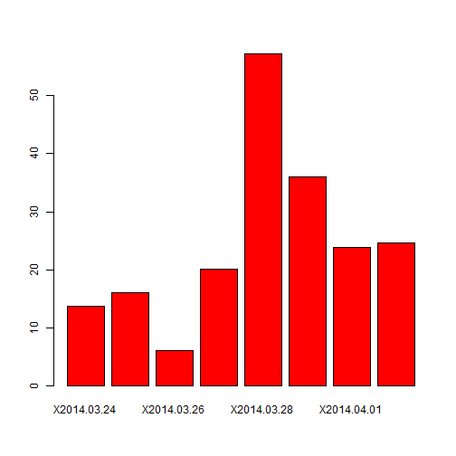
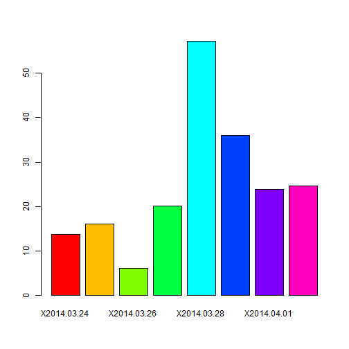
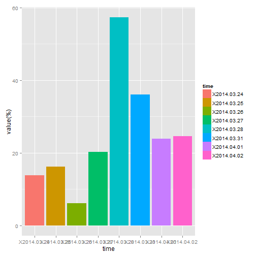

```r
library(ggplot2)
data = read.table("a.csv", head = TRUE, sep = ",")
data1 = data[, 10:17]
head(data1)
```

```
##   X2014.03.24 X2014.03.25 X2014.03.26 X2014.03.27 X2014.03.28 X2014.03.31
## 1           Y           Y           Y           Y           N           Y
## 2           Y           Y           Y           Y           N           N
## 3           Y           Y           Y           Y           N           Y
## 4           N           Y           Y           N           N           Y
## 5           Y           Y           Y           Y           Y           Y
## 6           N           N           N           Y           N           Y
##   X2014.04.01 X2014.04.02
## 1           Y           N
## 2           Y           N
## 3           Y           N
## 4           Y           Y
## 5           Y           Y
## 6           Y           N
```

```r

length = dim(data1)[1]
length
```

```
## [1] 297
```

```r
data3 = 1:8
data3
```

```
## [1] 1 2 3 4 5 6 7 8
```

```r
for (i in 1:8) {
    cout = 0
    for (j in 1:length) {
        if (isTRUE(data1[j, i] == "N")) {
            cout = cout + 1
        }
        data3[i] = cout
    }
}
data3 = data3 * 100/length
data5 = data3
names(data5) = colnames(data1)
barplot(data5, col = "red")
```

 

```r
barplot(data5, col = rainbow(8))
```

 

```r
data4 = matrix(c(colnames(data1)), 8, 1)
colnames(data4) = c("time")
data4 = as.data.frame(data4)
data4$value = data3
class(data4$value)
```

```
## [1] "numeric"
```

```r

ggplot(data4, aes(x = time, y = value, fill = time)) + geom_bar(stat = "identity") + 
    ylab("value(%)")
```

 

