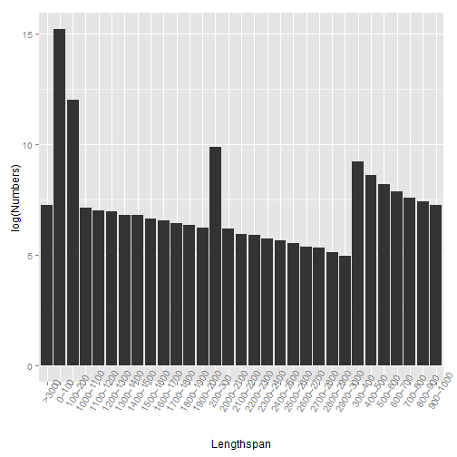
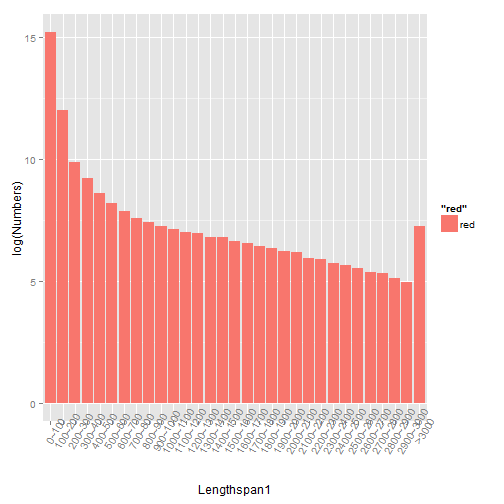

# 如何排序X轴坐标


```r
library(ggplot2)
A = read.table("123.txt", head = TRUE)
A
```

```
##    Lengthspan Numbers Percent
## 1       0~100 4001566   94.69
## 2     100~200  165467    3.92
## 3     200~300   19516    0.46
## 4     300~400    9959    0.24
## 5     400~500    5578    0.13
## 6     500~600    3623    0.09
## 7     600~700    2626    0.06
## 8     700~800    1987    0.05
## 9     800~900    1695    0.04
## 10   900~1000    1440    0.03
## 11  1000~1100    1265    0.03
## 12  1100~1200    1115    0.03
## 13  1200~1300    1044    0.02
## 14  1300~1400     914    0.02
## 15  1400~1500     886    0.02
## 16  1500~1600     752    0.02
## 17  1600~1700     697    0.02
## 18  1700~1800     630    0.01
## 19  1800~1900     580    0.01
## 20  1900~2000     516    0.01
## 21  2000~2100     482    0.01
## 22  2100~2200     385    0.01
## 23  2200~2300     368    0.01
## 24  2300~2400     305    0.01
## 25  2400~2500     283    0.01
## 26  2500~2600     248    0.01
## 27  2600~2700     217    0.01
## 28  2700~2800     204    0.00
## 29  2800~2900     167    0.00
## 30  2900~3000     145    0.00
## 31      >3000    1436    0.03
```

```r
# 如果直接画图,是按照字符串来排序的，
qplot(Lengthspan, log(Numbers), data = A, geom = "bar", stat = "identity") + 
    theme(axis.text.x = element_text(angle = 60))
```

 

```r
# 当然你可以转换成数字，但是最后一个元素，还有一个大于号
# 还是要曲线来实现这个目标
```


```r
# 因为A$Lengthspan是factor，先转化成字符
A$Lengthspan = as.character(A$Lengthspan)
# 添加新变量,用来排序
A$Lengthspan1 = 0
num = dim(A)[1]
num
```

```
## [1] 31
```

```r
for (i in 1:num) {
    # A[i,4]=unlist(strsplit(A[i,1],split='~'))[1]
    A[i, 4] = i
}
A
```

```
##    Lengthspan Numbers Percent Lengthspan1
## 1       0~100 4001566   94.69           1
## 2     100~200  165467    3.92           2
## 3     200~300   19516    0.46           3
## 4     300~400    9959    0.24           4
## 5     400~500    5578    0.13           5
## 6     500~600    3623    0.09           6
## 7     600~700    2626    0.06           7
## 8     700~800    1987    0.05           8
## 9     800~900    1695    0.04           9
## 10   900~1000    1440    0.03          10
## 11  1000~1100    1265    0.03          11
## 12  1100~1200    1115    0.03          12
## 13  1200~1300    1044    0.02          13
## 14  1300~1400     914    0.02          14
## 15  1400~1500     886    0.02          15
## 16  1500~1600     752    0.02          16
## 17  1600~1700     697    0.02          17
## 18  1700~1800     630    0.01          18
## 19  1800~1900     580    0.01          19
## 20  1900~2000     516    0.01          20
## 21  2000~2100     482    0.01          21
## 22  2100~2200     385    0.01          22
## 23  2200~2300     368    0.01          23
## 24  2300~2400     305    0.01          24
## 25  2400~2500     283    0.01          25
## 26  2500~2600     248    0.01          26
## 27  2600~2700     217    0.01          27
## 28  2700~2800     204    0.00          28
## 29  2800~2900     167    0.00          29
## 30  2900~3000     145    0.00          30
## 31      >3000    1436    0.03          31
```

```r
# A$Lengthspan1=as.numeric(A$Lengthspan1)
qplot(Lengthspan1, log(Numbers), data = A, geom = "bar", stat = "identity", 
    fill = "red") + theme(axis.text.x = element_text(angle = 60)) + xlim(A$Lengthspan)
```

 

