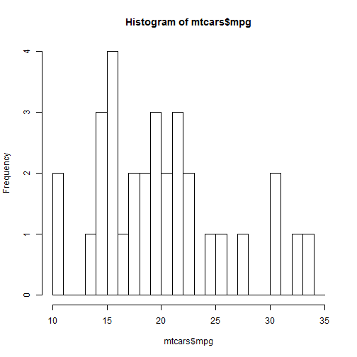
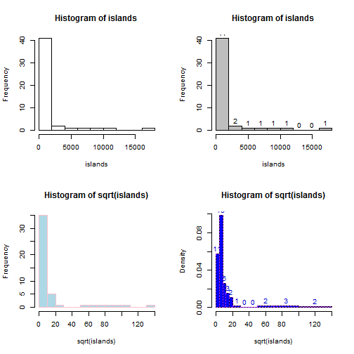
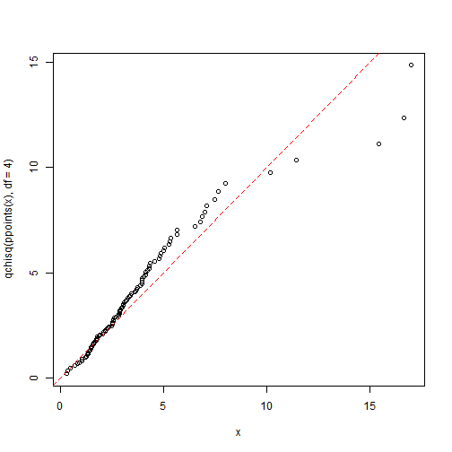
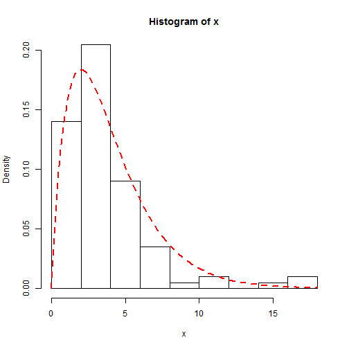

# 细说直方图
直方图的命令非常的简单，但是其中还有很多的参数可以调整，这些参数
都可以帮助你更好的掌控图形。

```r
hist(x, ...)
hist(x, breaks = "Sturges", freq = NULL, probability = !freq, include.lowest = TRUE, 
    right = TRUE, density = NULL, angle = 45, col = NULL, border = NULL, main = paste("Histogram of", 
        xname), xlim = range(breaks), ylim = NULL, xlab = xname, ylab, axes = TRUE, 
    plot = TRUE, labels = FALSE, nclass = NULL, warn.unused = TRUE, ...)
```

## x  
是用来画图的向量，只要具备x这一个参数就可以画出直方图

```r
hist(mtcars$mpg)
```

 

## breaks
你可能没有注意到的是breaks可以有几种方法来控制，我们最常见的是下面的第二种，

```r
# 1、给出分割点的序列，我们可以这样
seq = seq(10, 35, by = 1)
hist(mtcars$mpg, breaks = seq)
```

 

```r
# 2、这个最常用，直接给出分成的份数，比如：
hist(mtcars$mpg, breaks = 10)
```

 

```r
# 3、用算法来计算 这里breaks等于一个字符串命名的算法 4、用函数来计算
# 用函数来计算每一个方格的内的数目 a function to compute the number of
# cells.
```

## 直方图的相关信息
你完成作图以后，可能希望看到，每一个直方图的信息，比如，一个方格的间距，频数等。
那么你可以这样做：

```r
a = hist(mtcars$mpg, breaks = 10)
```

 

```r
a
```

```
## $breaks
##  [1] 10 12 14 16 18 20 22 24 26 28 30 32 34
## 
## $counts
##  [1] 2 1 7 3 5 5 2 2 1 0 2 2
## 
## $intensities
##  [1] 0.03125 0.01562 0.10938 0.04688 0.07812 0.07812 0.03125 0.03125
##  [9] 0.01562 0.00000 0.03125 0.03125
## 
## $density
##  [1] 0.03125 0.01562 0.10938 0.04688 0.07812 0.07812 0.03125 0.03125
##  [9] 0.01562 0.00000 0.03125 0.03125
## 
## $mids
##  [1] 11 13 15 17 19 21 23 25 27 29 31 33
## 
## $xname
## [1] "mtcars$mpg"
## 
## $equidist
## [1] TRUE
## 
## attr(,"class")
## [1] "histogram"
```

## freq  
freq是一个为逻辑型数值,如果为True，那么直方图的纵坐标代表的是频率，是数据在这一个方格中计数，
如果是FALSE，画出的是概率密度和组分密度(这里要保证所有直方图的面积为1。默认为TRUE。
## include.lowest
include.lowest	
logical; if TRUE, an x[i] equal to the breaks value will be included in the first (or last, for right = FALSE) bar. This will be ignored (with a warning) unless breaks is a vector.

right	
logical; if TRUE, the histogram cells are right-closed (left open) intervals.

## density
density	
the density of shading lines, in lines per inch. The default value of NULL means that no shading lines are drawn. Non-positive values of density also inhibit the drawing of shading lines.

angle	
the slope of shading lines, given as an angle in degrees (counter-clockwise).

col	
a colour to be used to fill the bars. The default of NULL yields unfilled bars.

border	
the color of the border around the bars. The default is to use the standard foreground color.

main, xlab, ylab	
these arguments to title have useful defaults here.

xlim, ylim	
the range of x and y values with sensible defaults. Note that xlim is not used to define the histogram (breaks), but only for plotting (when plot = TRUE).

axes	
logical. If TRUE (default), axes are draw if the plot is drawn.

plot	
logical. If TRUE (default), a histogram is plotted, otherwise a list of breaks and counts is returned. In the latter case, a warning is used if (typically graphical) arguments are specified that only apply to the plot = TRUE case.

labels	
logical or character. Additionally draw labels on top of bars, if not FALSE; see plot.histogram.

nclass	
numeric (integer). For S(-PLUS) compatibility only, nclass is equivalent to breaks for a scalar or character argument.

warn.unused	
logical. If plot = FALSE and warn.unused = TRUE, a warning will be issued when graphical parameters are passed to hist.default().

...	
further arguments and graphical parameters passed to plot.histogram and thence to title and axis (if plot = TRUE).

Details

The definition of histogram differs by source (with country-specific biases). R's default with equi-spaced breaks (also the default) is to plot the counts in the cells defined by breaks. Thus the height of a rectangle is proportional to the number of points falling into the cell, as is the area provided the breaks are equally-spaced.

The default with non-equi-spaced breaks is to give a plot of area one, in which the area of the rectangles is the fraction of the data points falling in the cells.

If right = TRUE (default), the histogram cells are intervals of the form (a, b], i.e., they include their right-hand endpoint, but not their left one, with the exception of the first cell when include.lowest is TRUE.

For right = FALSE, the intervals are of the form [a, b), and include.lowest means ‘include highest’.

A numerical tolerance of 1e-7 times the median bin size is applied when counting entries on the edges of bins. This is not included in the reported breaks nor (as from R 2.11.0) in the calculation of density.

The default for breaks is "Sturges": see nclass.Sturges. Other names for which algorithms are supplied are "Scott" and "FD" / "Freedman-Diaconis" (with corresponding functions nclass.scott and nclass.FD). Case is ignored and partial matching is used. Alternatively, a function can be supplied which will compute the intended number of breaks as a function of x.

Value

an object of class "histogram" which is a list with components:

breaks	
the n+1 cell boundaries (= breaks if that was a vector). These are the nominal breaks, not with the boundary fuzz.

counts	n
integers; for each cell, the number of x[] inside.

density	
values f^(x[i]), as estimated density values. If all(diff(breaks) == 1), they are the relative frequencies counts/n and in general satisfy sum[i; f^(x[i]) (b[i+1]-b[i])] = 1, where b[i] = breaks[i].

intensities	
same as density. Deprecated, but retained for compatibility until R 3.0.0.

mids	
the n cell midpoints.

xname	
a character string with the actual x argument name.

equidist	
logical, indicating if the distances between breaks are all the same.

nclass.Sturges, stem, density, truehist in package MASS.

Typical plots with vertical bars are not histograms. Consider barplot or plot(*, type = "h") for such bar plots.

# Examples

```r
op <- par(mfrow = c(2, 2))
hist(islands)
utils::str(hist(islands, col = "gray", labels = TRUE))
```

```
## List of 7
##  $ breaks     : num [1:10] 0 2000 4000 6000 8000 10000 12000 14000 16000 18000
##  $ counts     : int [1:9] 41 2 1 1 1 1 0 0 1
##  $ intensities: num [1:9] 4.27e-04 2.08e-05 1.04e-05 1.04e-05 1.04e-05 ...
##  $ density    : num [1:9] 4.27e-04 2.08e-05 1.04e-05 1.04e-05 1.04e-05 ...
##  $ mids       : num [1:9] 1000 3000 5000 7000 9000 11000 13000 15000 17000
##  $ xname      : chr "islands"
##  $ equidist   : logi TRUE
##  - attr(*, "class")= chr "histogram"
```

```r

hist(sqrt(islands), breaks = 12, col = "lightblue", border = "pink")
## -- For non-equidistant breaks, counts should NOT be graphed unscaled:
r <- hist(sqrt(islands), breaks = c(4 * 0:5, 10 * 3:5, 70, 100, 140), col = "blue1")
text(r$mids, r$density, r$counts, adj = c(0.5, -0.5), col = "blue3")
sapply(r[2:3], sum)
```

```
##      counts intensities 
##     48.0000      0.2156
```

```r
sum(r$density * diff(r$breaks))  # == 1
```

```
## [1] 1
```

```r
lines(r, lty = 3, border = "purple")  # -> lines.histogram(*)
```

 

```r
par(op)

require(utils)  # for str
str(hist(islands, breaks = 12, plot = FALSE))  #-> 10 (~= 12) breaks
```

```
## List of 7
##  $ breaks     : num [1:10] 0 2000 4000 6000 8000 10000 12000 14000 16000 18000
##  $ counts     : int [1:9] 41 2 1 1 1 1 0 0 1
##  $ intensities: num [1:9] 4.27e-04 2.08e-05 1.04e-05 1.04e-05 1.04e-05 ...
##  $ density    : num [1:9] 4.27e-04 2.08e-05 1.04e-05 1.04e-05 1.04e-05 ...
##  $ mids       : num [1:9] 1000 3000 5000 7000 9000 11000 13000 15000 17000
##  $ xname      : chr "islands"
##  $ equidist   : logi TRUE
##  - attr(*, "class")= chr "histogram"
```

```r
str(hist(islands, breaks = c(12, 20, 36, 80, 200, 1000, 17000), plot = FALSE))
```

```
## List of 7
##  $ breaks     : num [1:7] 12 20 36 80 200 1000 17000
##  $ counts     : int [1:6] 12 11 8 6 4 7
##  $ intensities: num [1:6] 0.03125 0.014323 0.003788 0.001042 0.000104 ...
##  $ density    : num [1:6] 0.03125 0.014323 0.003788 0.001042 0.000104 ...
##  $ mids       : num [1:6] 16 28 58 140 600 9000
##  $ xname      : chr "islands"
##  $ equidist   : logi FALSE
##  - attr(*, "class")= chr "histogram"
```

```r

hist(islands, breaks = c(12, 20, 36, 80, 200, 1000, 17000), freq = TRUE, main = "WRONG histogram")  # and warning
```

```
## Warning: the AREAS in the plot are wrong -- rather use freq=FALSE
```

 

```r

require(stats)
set.seed(14)
x <- rchisq(100, df = 4)

## Comparing data with a model distribution should be done with qqplot()!
qqplot(x, qchisq(ppoints(x), df = 4))
abline(0, 1, col = 2, lty = 2)
```

 

```r

## if you really insist on using hist() ... :
hist(x, freq = FALSE, ylim = c(0, 0.2))
curve(dchisq(x, df = 4), col = 2, lty = 2, lwd = 2, add = TRUE)
```

 

